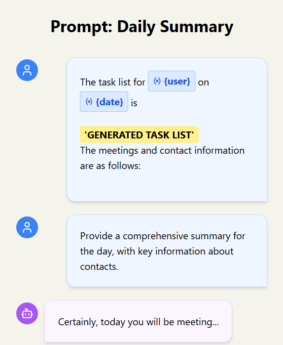

<style>
     .cite-author {  
      text-align        : right;
   }
   .cite-author:after {
      color             : orangered;
      font-size         : 125%;
      /* font-style        : italic; */
      font-weight       : bold;
      font-family       : Cambria, Cochin, Georgia, Times, 'Times New Roman', serif; 
      padding-right     : 130px;
   }
   .cite-author[data-text]:after {
      content           : " - "attr(data-text) " - ";      
   }

   .cite-author p {
      padding-bottom : 40px
   }
</style>

<!-- _class: titlepage -->

<div class="title"         > Resources: Building the Next Wave of MCP Apps</div>
<div class="subtitle"      > MCP Developers Summit, San Francisco   </div>
<div class="author"        > Shaun Smith                       </div>
<div class="date"          > May 2025                                    </div>
<div class="organization"  > llmindset.co.uk github.com/evalstate x.com/llmindsetuk</div>

---

# Tools

<div class="columns" style="grid-template-columns: 60% 40%;">
  <div>

## LLMs are **good** at ad-hoc integration

## Simple for MCP Server Developers to add to **Context** with Tool Descriptions and Results

## Relatively easy for MCP Client Applications to implement - symmetry with Chat Completion APIs

  </div>
  <div>

<center>

<!-- this was looped in the original presentation -->


</center>

  </div>

</div>

---

<!-- _class: transition -->

# _Tools_ require minimal coordination between MCP Server Developers and Client Application builders.

---

# Tools don't solve the _Context_ problem

<div class="columns">

<div>

## Tool Descriptions, Calls and Results are **consume context**.

## Even simple descriptions can easily consume 100-200 tokens per Tool.

## LLMs can **Get Lost in Multi-turn Conversation**

</div>

<div style="padding-left: 43px">

<!-- _class: cool-list -->

1. _find papers on the kazakh language_
2. _find related models_
3. _find related spaces_

```markdown
"Concise Scenario"

MCP Server (HF Search), 4 tools

"Interfere Scenario"

MCP Server (HF Search), 4 tools
MCP Official Filesystem - 11 tools
MCP Official Github - 40 tools
```

</div>

</div>

</div>

##

---

# Sonnet 3.7: 20 Runs - 47% longer, 89% more tokens

<center>


</center>

---

<!-- _class: transition -->

<div class="columns">

<div>

<center>


</center>

</div>

<div>

## ...we discover that when LLMs take a wrong turn in a conversation, they get lost and do not recover.

#### `https://hf.co/papers/2505.06120`

</div>

---

# Tools as a Conversation Turn

## Tool results aren't like traditional API responses: they become the _next turn_ in a conversation with the Assistant.

<div class="columns" style="grid-template-columns: 55% 45%;" >

<div>

## Some UX patterns emerging

- ## **Github/VSCode:** Dynamic Tool Bouquet
- ## **Claude.ai:** Selectable Tools

</div>

<div>
  <center>


  </center>

</div>

</div>

## We need to think about semantics not just data transfer...

---

<div class="columns" style="grid-template-columns: 70% 30%;">

<div>

# What do I do with this content?

### Client apps ask:

### Can I **render** it?

- ### Is this for the **Human** to see?
- ### Is this for the **LLM** to process?

### Can/Should I **transform** it?

### Most content will be sent via the LLM API as `text/plain` anyway...

## **Resources** gives us _semantics_

</div>

<div>

<center>


</center>

</div>

</div>

---

<div class="columns"  style="grid-template-columns: 60% 40%;">

  <div>

# A Closer look at Resources

## Is Textual or Binary data

## May suggest an **audience**

## Has a **MIME Type** and **uri**

## **Embeddable** in Prompts and Tool Results

<!--
```typescript
interface Resource {

---- Resource and EmbeddedResource
  // What is it?
  uri: "search://papers/quantum-2024/results"

  // How do I handle it?
  mimeType: "application/json"

  // Who is it for?
  audience?: ["assistant"] | ["user"] | ["user", "assistant"]


---- Resource Only
  // How should I show it?
  name: "2024 Quantum Theory.json"

  // How should I describe it to the Assistant?
  description: "This is the JSON results associated with
  the 2024 Quantum Theory Results"

}
```
-->

  </div>
  <div>

<center>


</center>

</div>

---

<div class="columns" >

<div>

# Prompts - User Intent

## Not _just_ instruction templating: a precise way to inject task context. Especially helpful if we know User _task intent_.

## Can contain `User/Assistant` conversation pairs **and** Resources.

</div>

<div>

<center>



<center>

</div>

</div>

---

<div class="columns">

<div>

# Using and Embedding Resources

## Prompts and Resources allow me to compose sophisticated tasks and workflows.

## Mime Types allow the Client Application to intelligently handle data

</div>

<div>

<center>


</center>

</div>

</div>

# For example

## MCP Servers that provide language specific capabilities such as Linting information as subscribable resources.

---

# Example - In-Context Learning for Code Maintenance

<div class="columns">

<div>

## fast-agent comes bundles with a `prompt-server` to make trying these ideas easy.

## In this example, we use in-context learning to load a sample input file and "teach" the LLM how to handle the next file in the conversation.

</div>

<div>

```text
---USER
Can you refactor this code to follow best practices?

---RESOURCE
poor_input.ts

---ASSISTANT
Here's the refactored code:
- Changed let to const
- Added type annotations
- Used 2-space indentation
- Added explicit return type

const userName = "John";
function getUser(id: string): User {
  return database.find(id);
}

---USER
Can you refactor this code?

---RESOURCE
legacy_code.ts
```

</div>

</div>

---

# Resource Features and Sampling

<div class="columns" style="grid-template-columns: 50% 50%;">

<div>

## 🔄 **Subscribable**

`weather://san-francisco/current`
→ Updates every 10 minutes (trigger new generation)

`typescript://project/errors`
→ Mutate context with current status feedback

## 🔍 **Discoverable**

Completions help users find available resources for interactive use.

</div>

<div>

## 🎯 **Templated**

`calendar://meetings/{date}`
→ Fetch any day's meetings

`github://issues/{repo}/{number}`
→ Access any issue dynamically
<br>

## ⚡ **Sampling**

Sampling can summarise or pre-process upstream content optimize main conversation thread.
`hub://papers/{number}/auto-summary`

</div>

</div>

---

<!-- _class: transition -->

# _URI schemes_ enable MCP Server Developers and Client Application builders to coordinate expectations and share understanding

---

# Sharing Semantic Expectations

## _URI schemes_ allow MCP Server developers and Client Application builders to share semantic contracts with each other.

<div class="columns">
<div>

<br />

```ts
// HOME AUTOMATION
mcp://homeauto/sensors/list
mcp://sensor/temperature/living-room
mcp://sensor/motion/front-door
mcp://sensor/camera/mcp-webcam

search://papers?topic=llm&limit=10
```

</div>
<div>

### Client knows:

- How to display sensor data
- How to subscribe to updates
- What UI components to show
- Aggregate common MCP Server capabilities

</div>

</div>

---

# Example: Rich UI Client Libraries

<div class="columns">

  <div>

<video width="500" height="450" autoplay loop muted>

  <source src="images/2025-05-22-mcpui.mp4" type="video/mp4" />

</video>

  </div>

  <div>

### `mcp-ui` by Ido Salomon (github.com/idosal)

### Demonstrates a `ui://` URI scheme for returning rich HTML content for interaction.

### Includes both Client and Server SDKs and reference examples.

### The same principle can apply to any number of domains (CRM, Home Automation, Platform Integration...)

  </div>

</div>

##

---

# URI Schemes

## Using known URI schemes, MCP Server and Host Application Developers can share:

- ## Knowledge of Schemas
- ## Expected Hierarchy of Resources and Templates
- ## SDKs to accelerate rich integration of advanced features.

## This is useful for both generic applications (e.g. User Interaction Patterns, Sorting/Filtering datasets) as well as Domain Specific implementations.

---

# Summary

### Resources provide semantics, not just data transfer - they tell us what content is, who it's for, and how to handle it

### URI schemes enable coordination between MCP Server developers and - Client apps - sharing semantic contracts for advanced features

### Prompts enable sophisticated task composition - especially powerful when we know User/Agent task intent (assembling resources, in-context learning)

### Optimize tools for actions, Resources for context - consider fallback modes for compatibility across different clients

### https://modelcontextprotocol-community.github.io/working-groups/

<center>

## github.com/evalstate : x.com/llmindsetuk

</center>

---

<!-- _class: biblio -->


1. LLMs Get Lost In Multi-Turn Conversation : https://hf.co/papers/2505.06120
1. mcp-ui https://github.com/idosal/mcp-ui
1. MCP community Working Groups https://modelcontextprotocol-community.github.io/working-groups/
1. Client/Server Content capabilities https://github.com/modelcontextprotocol/modelcontextprotocol/pull/223
1. Prompts for in-context learning: https://x.com/llmindsetuk/status/1899148877787246888
1. PulseMCP Video demonstrating ICL, Dynamic Resource Generation and `prompt-server`: https://www.youtube.com/watch?v=MvFIo-qSwLU

---

<!-- _class: biblio -->


# Thank you
