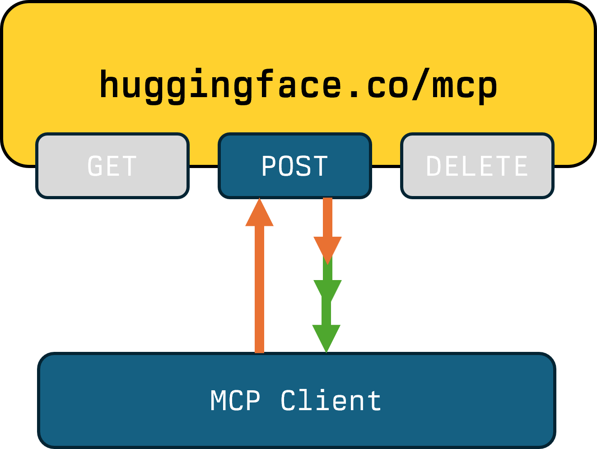

<style>
     .cite-author {  
      text-align        : right;
   }
   .cite-author:after {
      color             : orangered;
      font-size         : 125%;
      /* font-style        : italic; */
      font-weight       : bold;
      font-family       : Cambria, Cochin, Georgia, Times, 'Times New Roman', serif; 
      padding-right     : 130px;
   }
   .cite-author[data-text]:after {
      content           : " - "attr(data-text) " - ";      
   }

   .cite-author p {
      padding-bottom : 40px
   }

   /* Bottom-positioned wide image */
   .bottom-image {
     position: absolute;
     bottom: 20px;
     left: 50%;
     transform: translateX(-50%);
     width: calc(100% - 40px);
     max-width: 95%;
   }

   .bottom-image img {
     width: 100%;
     height: auto;
     object-fit: contain;
   }

   /* Alternative: Fixed to bottom with no padding */
   .bottom-image-flush {
     position: absolute;
     bottom: 0;
     left: 0;
     right: 0;
     width: 100%;
   }

   .bottom-image-flush img {
     width: 100%;
     height: auto;
     object-fit: contain;
   }

</style>

<!-- _class: titlepage -->

<div class="title"         > Streams, Sessions, Stats: Transport and Client Behaviour</div>
<div class="subtitle"      > MCP Dev Summit, London   </div>
<div class="author"        > Shaun Smith                       </div>
<div class="date"          > October 2025                                    </div>
<table class="social-table">
  <tbody>
    <tr>
      <td></td>
      <td><a class="organization" href="https://huggingface.co/evalstate">huggingface.co/evalstate</a></td>
    </tr>
    <tr>
      <td></td>
      <td><a class="organization" href="https://github.com/evalstate">github.com/evalstate</a></td>
    </tr>
    <tr>
      <td></td>
      <td><a class="organization" href="https://x.com/evalstate">x.com/evalstate</a></td>
    </tr>
  </tbody>
</table>

<!-- -->

---

## Huge Traffic Drop!


<!-- educational, bit of data, what next -->

---

# Simple Request/Response MCP Server


<!-- Stateless JSON-RPC. All we can do is respond. Fine!

If you don't need state. MCP SDK can still do some of the lifting for you. -->
<!-- when i was here last time, i said the great thing about MCP was it just worked -->
<!-- we have lots of options for Streamable HTTP and not much time, so we'll build up -->


<div class="columns">

<div>

### Examples - HuggingFace MCP Server with analytics OFF.

### Simple `POST` Handler that returns the JSON-RPC Repsonse.

### Return a 405 from the `GET` handler.

</div>

<div align="center">


> technically possible to run without the Initialize lifecycle events [we'll comeback to that later]

</div>

</div>

<div class="bottom-image">
  
</div>

---

# Stateless HTTP MCP Server


<!-- Stateless JSON-RPC. All we can do is respond. Fine!

If you don't need state. MCP SDK can still do some of the lifting for you. -->


<div class="columns">

<div>

## For Simple Tools `enableJSONResponse` gives 10-20% improvement in throughput and latency


</div>

<div>


```typescript

new StreamableHTTPServerTransport(){
    sessionIdGenerator: undefined,
    // NB: Not Default
    enableJSONResponse: true
}

```


</div>

</div>

<div class="bottom-image">
  
</div>

---

# Tool Progress Notifications


<div class="columns">

<div>

### Long Running Tools may wish to emit descriptive Progress Updates. 

### The `POST` handler can decide to return an `event-stream` and send _related_ Notifications to the Host.

### Example: Gradio Tool Calls on Hugging Face

</div>

<div align="center">



</div>

</div>


<div class="bottom-image">
  
</div>

---


# Sampling, Elicitations and Roots


<div class="columns">

<div>


### We can use the `event-stream` to send a  _related_ Request to the Host.

### Now the Host needs to send back the response via another `POST` request (and the server responds with a `202`). 
### Example: Everything Server Elicitation

</div>

<div>

### We need an associative JSON RequestId.

### Final Result is returned on the SSE Stream.
_Shaun to get his facts straight_


```typescript

// big SDK Gotcha!


```


</div>

</div>


<div class="bottom-image">
  
</div>

---


# The Full MCP Experience


<div class="columns">

<div>

### Now we add a `GET` handler to maintain an open stream to send notifications to the Host.

### Server needs to make sure Notifications and Requests are sent via the correct channel for correlation.

</div>

<div>


```typescript

// big SDK Gotcha!


```


</div>

</div>


<div class="bottom-image">
  
</div>

---


# Ping!

The Host can `POST` to the Server to tell it's alive
The Server can tell whether or not the Host is Responsive.
Host Ping tells you if the POST endpoint works.
Server Ping tells you if the GET channel is open.
<div class="columns">

<div>

#### Examples: `webcam.fast-agent.ai/mcp`
#### Hugging Face MCP Server in StreamableHTTP Mode.


</div>

<div>


</div>

</div>


---

## PAIN POINTS (SO FAR)

- Using the wrong "Channel"
- Maintaining the GET channel Open
- Handling PING failures.
- Python ALWAYS opens GET when used as a Server.


- Jeff R. [Elicitation for agreeing to return PII]
- Jsff R. [MS Teams] conversation to file defect, make sure template is filled out (select template to fill out defect template).

---


---


# MCP Method Calls per 1,000,000 `intitalize`
<!-- _class: dataset-makeup -->

<style scoped>
  section.dataset-makeup table td:first-child {
    font-weight: 700;
    white-space: nowrap;
  }
  section.dataset-makeup table tr:hover {
    background-color: var(--table-hover-background-color) !important;
    color: var(--table-hover-color) !important;
    font-weight: 700;
  }
</style>

_todo_ add august numbers for comparison.
NB - This is Hugging Face Specific

| method | number |
| --- | ---: |
| `Actual Tool/Prompt Calls` | 31585 |
| `initialize` | 1000000 |
| `tools/list` | 1174585 |
| `notifications/initialized` | 981514 |
| `prompts/list` | 684883 |
| `resources/list `|606454 |
| `notifications/cancelled` | 150162 |
| `ping` | 27129 |
| `resources/templates/list` | 21795 |


---

# Initialize != Usage

## Two types of Clients

<div class="columns">

<div>

## User Clients

### User installs MCP Server in Interactive Host.
### Host 
### Server may get called during session

</div>

<div>

## Automations

### MCP Server is used as part of an automation, or from a "Remote" Host - for example OpenAI Remote MCP.

### Burst of activity close

</div>


</div>


---

#### Client Top 20 and Features

<!-- _class: top-clients -->
<!--
Usage Guide:
- Session deletion icon: <span class="icon-delete"></span>
- Alert/warning icon: <span class="icon-alert"></span>
- Enabled capability: <span class="capability-icon"></span>
- Disabled capability: <span class="capability-icon disabled"></span>
  - folders.svg = Roots
  - cpu.svg = Sampling
  - message-circle-question-mark.svg = Elicitation
- Icons are placed in the <div class="client-icons"> container
- Enabled capabilities: bold blue color with light blue background
- Disabled capabilities: subtle gray with minimal background
- Delete/Alert icons: red color with light red background
-->

<table>
<thead>
<tr><th>#</th><th>Client</th><th>Icons</th><th>#</th><th>Client</th><th>Icons</th></tr>
</thead>
<tbody>
<tr>
  <td>1</td><td>claude-ai</td><td><div class="client-icons"><span class="capability-icon disabled"></span><span class="capability-icon disabled"></span><span class="capability-icon disabled"></span></div></td>
  <td>11</td><td>docker-mcp-gateway</td><td><div class="client-icons"><span class="icon-delete"></span><span class="capability-icon"></span><span class="capability-icon disabled"></span><span class="capability-icon disabled"></span></div></td>
</tr>
<tr>
  <td>2</td><td>lmstudio-mcp-bridge</td><td><div class="client-icons"><span class="capability-icon disabled"></span><span class="capability-icon disabled"></span><span class="capability-icon disabled"></span></div></td>
  <td>12</td><td>groq-mcp-client</td><td><div class="client-icons"><span class="capability-icon disabled"></span><span class="capability-icon disabled"></span><span class="capability-icon disabled"></span></div></td>
</tr>
<tr>
  <td>3</td><td>Visual Studio Code</td><td><div class="client-icons"><span class="capability-icon"></span><span class="capability-icon"></span><span class="capability-icon"></span></div></td>
  <td>13</td><td>openai-mcp</td><td><div class="client-icons"><span class="capability-icon disabled"></span><span class="capability-icon disabled"></span><span class="capability-icon disabled"></span></div></td>
</tr>
<tr>
  <td>4</td><td>test-client</td><td><div class="client-icons"><span class="icon-alert"></span><span class="capability-icon"></span><span class="capability-icon"></span><span class="capability-icon disabled"></span></div></td>
  <td>14</td><td>Cherry Studio</td><td><div class="client-icons"><span class="capability-icon disabled"></span><span class="capability-icon disabled"></span><span class="capability-icon disabled"></span></div></td>
</tr>
<tr>
  <td>5</td><td>cursor-vscode</td><td><div class="client-icons"><span class="icon-alert"></span><span class="capability-icon"></span><span class="capability-icon disabled"></span><span class="capability-icon disabled"></span></div></td>
  <td>15</td><td>fast-agent-mcp</td><td><div class="client-icons"><span class="icon-delete"></span><span class="capability-icon disabled"></span><span class="capability-icon"></span><span class="capability-icon"></span></div></td>
</tr>
<tr>
  <td>6</td><td>claude-code</td><td><div class="client-icons"><span class="capability-icon"></span><span class="capability-icon disabled"></span><span class="capability-icon disabled"></span></div></td>
  <td>16</td><td>codex (via mcp-remote)</td><td><div class="client-icons"><span class="capability-icon disabled"></span><span class="capability-icon disabled"></span><span class="capability-icon"></span></div></td>
</tr>
<tr>
  <td>7</td><td>mcp (via mcp-remote)</td><td><div class="client-icons"><span class="capability-icon"></span><span class="capability-icon"></span><span class="capability-icon"></span></div></td>
  <td>17</td><td>claude-ai (via mcp-remote)</td><td><div class="client-icons"><span class="capability-icon disabled"></span><span class="capability-icon disabled"></span><span class="capability-icon disabled"></span></div></td>
</tr>
<tr>
  <td>8</td><td>Anthropic/ClaudeAI</td><td><div class="client-icons"><span class="capability-icon disabled"></span><span class="capability-icon disabled"></span><span class="capability-icon disabled"></span></div></td>
  <td>18</td><td>@n8n/langchain.mcpClientT</td><td><div class="client-icons"><span class="icon-alert"></span><span class="capability-icon disabled"></span><span class="capability-icon disabled"></span><span class="capability-icon disabled"></span></div></td>
</tr>
<tr>
  <td>9</td><td>mcp</td><td><div class="client-icons"><span class="icon-delete"></span><span class="capability-icon"></span><span class="capability-icon"></span><span class="capability-icon"></span></div></td>
  <td>19</td><td>lobehub-mcp-client</td><td><div class="client-icons"><span class="capability-icon disabled"></span><span class="capability-icon disabled"></span><span class="capability-icon disabled"></span></div></td>
</tr>
<tr>
  <td>10</td><td>Manus</td><td><div class="client-icons"><span class="icon-delete"></span><span class="capability-icon disabled"></span><span class="capability-icon disabled"></span><span class="capability-icon disabled"></span></div></td>
  <td>20</td><td>dev.warp.Warp-Stable</td><td><div class="client-icons"><span class="capability-icon disabled"></span><span class="capability-icon disabled"></span><span class="capability-icon disabled"></span></div></td>
</tr>
</tbody>
</table>


---


# Allocating a "GET" to each user

## Data c/o Jeff Richter , Microsoft Azure.

Jeff's Graph Here showing top-out

## GET Disconnect behaviour (silent failures).

---

# Thread of Execution? Handling POST Responses.

## Hosts responding to a Request from _either_ the `GET` or `POST SSE` stream send their Response with a new `POST` to which the MCP Server responds with a 202. 

## In a multi-server environment (e.g. load balanced), it requires either a sticky session or.

## Scale 


---

# Sessions

## Typically OAuth used for Identity, Mcp-Session-Id used for correlation .

## Causes the "Conversational Context" problem.

## VSCode uses a new Connection per Conversation Thread (find discord image)

---

# Relevant SEPs

## Initialize Language Wording - Allow us to 

## Elevate Sessions #1364 - Host controlled Sessions, SessionId to the Data, not Transport layer.

## SEP #1442 - 

## HTTP/gRPC Transport Proposals - Reduce overhead

---


## Request associated Sampling and Elicitation

If the Server wants to use Sampling or Elicitation we can send those on the associated SSE stream. The Client handles them, and sends the response back with a POST message.

**MAKE SURE YOU HAVE ALLOCATED A SESSION ID** so the Response can be associated with the request. The server responds with a 202 only (no new streams etc).

---

# Allocating an Mcp-Session-Id

### Server Controlled
### Only need it request/response association
### If you are using SDK this will all happen anyway.
### We need to decide on the. The SDK _should_ reset timeout counters on received events....

---

## Server initiated Sampling and Elicitation, 

In this case we need to maintain an open GET channel. 

Client Listens, handles requests it receives, and POSTs back as previously. 

- SDK behaviour:


---

## Change Notifications Subscriptions.

Per-Server state - now I need to think about saving state somehow - what things are switched on/off? So persistence becomes the issue. 

Although these are separate methods, the request is the same: re-read.

(Note this isn't an actual requirement - the notification just says read the list again - but practically....)

---

# Session Deletion

At the end. Reconstruct that state. 

---

# Identity and State

Hugging Face MCP Server in Production allows configuration of Tools per User. We use the OAuth identity to enable that. 

OAUTH : Persistent Settings for User
SessionID : Host/Conversational State

| OAuth / API Key | SessionID |
|----------------|------------|
| User Identity  | Conversational State |
| (MCP Server Configuration) | ???? |

---

# Host Application and User Behaviour. 

- Users install MCP Servers in Host Applications create, but don't delete Sessions.
- If you are using MCP Sessions this creates resource demands.

---

Back to the Chart of "what happened".

---

# 

# For simple JSON-RPC, MCP has overhead

## Lots of calls (e.g. 2 step initialization, followed by prompts listings etc.)

## Having to inspect JSON-RPC packets for routing rather than typical HTTP handler patterns (makes caching even of static things like Tool Lists hard)
## Has to handle the JSON-RPC body to identify the requested operation. (Writing low-value code to fulfil the transport requirements).


---

## Client / User Behaviour

Show ratio of initialization to Tool Calls. Note that lots of initialize != lots of usage necessarily.

---

# Allocating a "GET" to each user

## Data c/o Jeff Richter , Microsoft Azure.


---


---

# In Practice

Load Balancing and Fault Tolerance

1. Sampling/Elicitation - we expect a response on our own Thread of execution.
1. 

---

STDIO; serializing requests
blocking behaviour, "taking turns". Use of STDOUT breaks connection.

Single Process, Single "User".
No "Sessions", isolation through instancing.

I want to connect by LLM . "just works"

How does it work?

Trade-offs

Developer Experience - good.


How to use the correct channel.
    The requestId is a hint to the channel.

Differences between SDKs.

---


---
### section


What do we mean by Statelessness of the Protocol vs. Sessions

- Interesting Stats
- Clients that Delete Sessions
- "Chattiness"
- User Behaviour

---

Options. 

Supporting Multiple Threads/Agents.

Optimized for what Clients/Users do?


---

Data 

- Without roadmap from claude.ai it's hard to know what mcp server developers can rely on .
- surety from 
- Coding Tools are reasonably well supported.
- IDEs. Utility of MCP constrained due to Tool confusion; developer experience building custom solutions. Commoditized servers.

---

