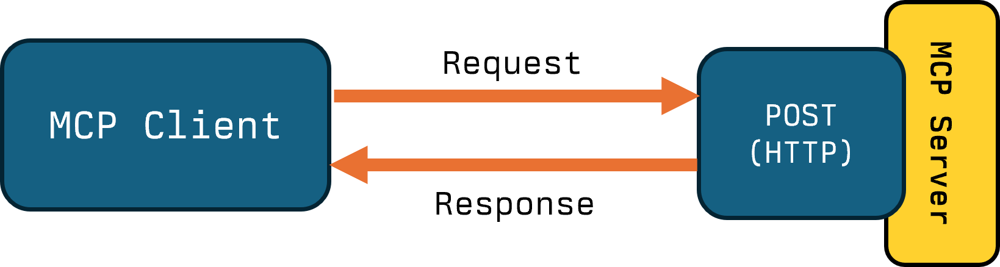

<style>
     .cite-author {  
      text-align        : right;
   }
   .cite-author:after {
      color             : orangered;
      font-size         : 125%;
      /* font-style        : italic; */
      font-weight       : bold;
      font-family       : Cambria, Cochin, Georgia, Times, 'Times New Roman', serif; 
      padding-right     : 130px;
   }
   .cite-author[data-text]:after {
      content           : " - "attr(data-text) " - ";      
   }

   .cite-author p {
      padding-bottom : 40px
   }

   /* Bottom-positioned wide image */
   .bottom-image {
     position: absolute;
     bottom: 20px;
     left: 50%;
     transform: translateX(-50%);
     width: calc(100% - 40px);
     max-width: 95%;
   }

   .bottom-image img {
     width: 100%;
     height: auto;
     object-fit: contain;
   }

   /* Alternative: Fixed to bottom with no padding */
   .bottom-image-flush {
     position: absolute;
     bottom: 0;
     left: 0;
     right: 0;
     width: 100%;
   }

   .bottom-image-flush img {
     width: 100%;
     height: auto;
     object-fit: contain;
   }

</style>

<!-- _class: titlepage -->

<div class="title"         > Streams, Sessions, Stats: Transport and Client Behaviour</div>
<div class="subtitle"      > MCP Dev Summit, London   </div>
<div class="author"        > Shaun Smith                       </div>
<div class="date"          > October 2025                                    </div>
<table class="social-table">
  <tbody>
    <tr>
      <td></td>
      <td><a class="organization" href="https://huggingface.co/evalstate">huggingface.co/evalstate</a></td>
    </tr>
    <tr>
      <td></td>
      <td><a class="organization" href="https://github.com/evalstate">github.com/evalstate</a></td>
    </tr>
    <tr>
      <td></td>
      <td><a class="organization" href="https://x.com/evalstate">x.com/evalstate</a></td>
    </tr>
  </tbody>
</table>


<!-- -->

---

<div class="columns">

<div>

# Shaun Smith `@evalstate`

- ### @ Hugging Face MCP
- ### MCP Maintainer / Transports WG
- ### Transports WG
- ### Maintainer of `fast-agent` 

</div>


<div class="center">


</div>


</div>


---

# Hugging Face MCP Server: Huge Traffic Drop!


<!-- educational, bit of data, what next -->

---

# Request/Response Streamable HTTP MCP Server


<!-- Stateless JSON-RPC. All we can do is respond. Fine!

If you don't need state. MCP SDK can still do some of the lifting for you. -->
<!-- when i was here last time, i said the great thing about MCP was it just worked -->
<!-- we have lots of options for Streamable HTTP and not much time, so we'll build up -->

### 

<div class="columns">

<div>

### If all you need are __Tools__, __Prompts__, __Resources__ (and __Completions__) this is enough!

### Client `POST`'s its Request to the MCP Server - which returns a JSON-RPC response.

### Normal HTTP!


</div>

<div class="no-shadow">

<center>



</center>

```typescript
new StreamableHTTPServerTransport(){
    // Note: Not Default!
    enableJSONResponse: true
}
```


</div>

</div>

<!-- <div class="bottom-image">
  
</div>
-->

---

# Adding Tool Progress Notifications

<div class="columns">

<div>

### Longer running Tools (like Image Generation) can send __Progress Notifications__.

### MCP Server responds to the `POST` Request with an `SSE` Stream.

### Server Streams notifications to Client, then the Response, and closes.

<div class="emphasis-box">

MCP Server developer should make sure Notifications are sent on the correct channel.

</div>

</div>

<div class="no-shadow">

<center>


</center>

```typescript
async (request, extra) => {
  await server.notification({
    method: "notifications/statusUpdate",
    params: { /* your params */ }
  }, { relatedRequestId: extra.requestId });
};

```

```python
await session.send_progress_notification(
    progress_token="token-789",
    progress=50,
    related_request_id="tool-call-456"  
)
```


</div>

</div>

<!-- >
<div class="bottom-image">
  
</div>
-->

---

# Server Elicitation Request related to Tool Call


<div class="columns">

<div>

### MCP can be _bi-directional_: Servers can make Sampling and Elicitation requests _to_ the Client.

### Server sends its Elicitation Request via the Tool's Response SSE stream. 

### Elicitation Result is POSTed to the MCP Server with it's `Request-ID` for association - and returns a 202.

### Server then returns the Tool Result via the original Post SSE stream.

</div>

<div class="no-shadow">


### Note that the Elicitation Request __should complete__ before the SSE Connection times out!

> This applies to any associated Request / Response method, but Tool and Elicitation chosen to keep example simple.

</div>

</div>


---


# Server Request to Client (Server Initiated)

Server Initiated communications happen over a `GET SSE` Stream. This includes __Resource Subscriptions__,__List Change Notifications__ or Server-Initiated __Sampling/Elicitation__.

<center> 

<div class="no-shadow">


</div>

</center>

---


# Ping!


<div class="columns">


<div>

The Host can `POST` a Ping to the Server to tell it's alive.
The Server can __Ping__ the Host via the `GET SSE` Channel (if open). 


</div>

<div>

<center>


</center>

</div>

</div>


---

<!-- _class: mcp-features -->

### _REFERENCE: Capabilities Matrix_

| | |
| --- | --- |
| __POST/JSON__ |  |
| __POST/SSE__ |  |
| __POST/SSE__<br />__+Response__ |  |
| __POST/SSE__<br />__GET/SSE__<br />__+Response__ |  |

---

# Using `Mcp-Session-Id`

<div class="emphasis-box">

#### An MCP "session" consists of logically related interactions between a client and a server, beginning with the initialization phase.

</div>

### Sessions are controlled by the MCP Server, not the Host - and are embedded within the Streamable HTTP Transport.

### Knowledge about the User is usually handled with OAuth Identity or API key (e.g. ZeroGPU Quota, Selected Spaces).

---

# `Mcp-Session-Id` for Conversational State?

<div class="columns">

<div>

#### The `Mcp-Session-Id` is `NOT` a Chat ID.

> VSCode uses one Transport Session per Chat

</div>

<div>

### Desirable or undesirable this behaviour should be _intentional_.

</div>

</div>

<!--  -->
<!-- _class: conversational-state -->

<table class="state-table show-headers">
<thead>
<tr>
  <th>Server State</th>
  <th>Chat 1: "Production Issue"</th>
  <th>Chat 2: "Testing Cleanup"</th>
</tr>
</thead>
<tbody>
<tr>
  <td><code>DB: staging</code></td>
  <td></td>
  <td>"Show me the test data"</td>
</tr>
<tr>
  <td><code>DB: staging</code></td>
  <td>"I need to check production"</td>
  <td></td>
</tr>
<tr>
  <td><code>DB: staging</code></td>
  <td>"Switch to production database"</td>
  <td></td>
</tr>
<tr class="state-change-row">
  <td><code>DB: production</code></td>
  <td>"What are the recent orders?"</td>
  <td></td>
</tr>
<tr class="danger-row">
  <td><code>DB: production</code></td>
  <td></td>
  <td>"Delete those old records"</td>
</tr>
<tr class="danger-row">
  <td><code>DB: production</code></td>
  <td></td>
  <td><strong>💥 Deletes production data!</strong></td>
</tr>
</tbody>
</table>


---

# `Mcp-Session-Id` for Routing

<div class="columns">

<div class="no-shadow">


</div>

<div>

### With Multiple MCP Server instances, _Client to Server Responses_ needs to go the correct Server.

### `Mcp-Session-Id` HTTP Header can be used for Routing to the correct Server (sticky sessions).

### Sharing `Mcp-Session-Id` state amongst the cluster is not enough: Both `Mcp-Session-Id` and Elicitation `RequestId` are needed for correlation.

</div>

</div>


---

# Hugging Face MCP Server: Huge Traffic Drop!


<div class="zoom-effect zoom-effect--claude">


</div>

---

### MCP Method Call Ratios / Hugging Face MCP Server)
<!-- _class: mcp-features -->

<div class="columns">

<div>

<table class="show-headers">
<thead>
<tr><th>MCP Method</th><th>Aug</th><th>Sep</th></tr>
</thead>
<tbody>
<tr><td><code>initialize</code></td><td>1.000</td><td>1.000</td></tr>
<tr><td><code>tools/list</code></td><td>0.400</td><td>1.175</td></tr>
<tr><td><code>notifications/initialized</code></td><td>0.995</td><td>0.982</td></tr>
<tr><td><code>prompts/list</code></td><td>1.081</td><td>0.685</td></tr>
<tr class="warning-row"><td><code>resources/list</code></td><td>1.039</td><td>0.606</td></tr>
<tr><td><code>notifications/cancelled</code></td><td>0.063</td><td>0.150</td></tr>
<tr class="highlight-row"><td><code>Actual Tool/Prompt Calls</code></td><td>0.011</td><td>0.032</td></tr>
<tr><td><code>ping</code></td><td>0.001</td><td>0.027</td></tr>
<tr class="warning-row"><td><code>resources/templates/list</code></td><td>0.000</td><td>0.022</td></tr>
</tbody>
</table>

</div>

<div>


Initialization sequence is usually at least 3 calls. 

MCP has significant overhead. For September:
 - We see __~3__ Tool/Prompt Calls per 100 Initialize events.
 - and __~165__ MCP Method Calls for every Tool/Prompt Call. 
 - compared to __547__ in August!

The `resource` methods aren't supported, yet clients still request them.

JSON-RPC content stops standard HTTP Cache mechanisms.
</div>

</div>


---

# Initialize != Usage

<div class="columns">

<div>

## Interactive Hosts (IDE/UI)

### Sessions may remain open for minutes/hours. 

### Tool/Prompt Usage is User driven so idle sessions are normal.

### VSCode has a high "efficiency ratio"

### Examples are __claude-ai__, __windsurf-client__ and __mcp-inspector__.

</div>

<div>

## Gateways / Embedded Hosts

### MCP Server is used as part of an automation, from a "Remote" Host or a gateway. 

### Burst of activity to Initialize and Call Tool that typically lasts under 5 seconds. 

### Examples are __openai-mcp__, __docker-mcp-gateway__, and __javelin-mcp-client__.

</div>


</div>


---

### Client Top 20 (by Usage) with Capabilities / Approx ~1.5m Sessions Sep '25

<!-- _class: top-clients -->
<!--
Usage Guide:
- Session deletion icon: <span class="icon-delete"></span>
- Alert/warning icon: <span class="icon-alert"></span>
- Enabled capability: <span class="capability-icon"></span>
- Disabled capability: <span class="capability-icon disabled"></span>
  - folders.svg = Roots
  - cpu.svg = Sampling
  - message-circle-question-mark.svg = Elicitation
- Icons are placed in the <div class="client-icons"> container
- Enabled capabilities: bold blue color with light blue background
- Disabled capabilities: subtle gray with minimal background
- Delete/Alert icons: red color with light red background
-->

<table>
<thead>
<tr><th>#</th><th>Client</th><th>Icons</th><th>#</th><th>Client</th><th>Icons</th></tr>
</thead>
<tbody>
<tr>
  <td>1</td><td>claude-ai</td><td><div class="client-icons"><span class="capability-icon disabled"></span><span class="capability-icon disabled"></span><span class="capability-icon disabled"></span></div></td>
  <td>11</td><td>docker-mcp-gateway</td><td><div class="client-icons"><span class="icon-delete"></span><span class="capability-icon"></span><span class="capability-icon disabled"></span><span class="capability-icon disabled"></span></div></td>
</tr>
<tr>
  <td>2</td><td>lmstudio-mcp-bridge</td><td><div class="client-icons"><span class="capability-icon disabled"></span><span class="capability-icon disabled"></span><span class="capability-icon disabled"></span></div></td>
  <td>12</td><td>groq-mcp-client</td><td><div class="client-icons"><span class="capability-icon disabled"></span><span class="capability-icon disabled"></span><span class="capability-icon disabled"></span></div></td>
</tr>
<tr>
  <td>3</td><td>Visual Studio Code</td><td><div class="client-icons"><span class="capability-icon"></span><span class="capability-icon"></span><span class="capability-icon"></span></div></td>
  <td>13</td><td>openai-mcp</td><td><div class="client-icons"><span class="icon-delete"></span><span class="capability-icon disabled"></span><span class="capability-icon disabled"></span><span class="capability-icon disabled"></span></div></td>
</tr>
<tr>
  <td>4</td><td>test-client</td><td><div class="client-icons"><span class="icon-alert"></span><span class="capability-icon"></span><span class="capability-icon"></span><span class="capability-icon disabled"></span></div></td>
  <td>14</td><td>Cherry Studio</td><td><div class="client-icons"><span class="capability-icon disabled"></span><span class="capability-icon disabled"></span><span class="capability-icon disabled"></span></div></td>
</tr>
<tr>
  <td>5</td><td>cursor-vscode</td><td><div class="client-icons"><span class="icon-alert"></span><span class="capability-icon"></span><span class="capability-icon disabled"></span><span class="capability-icon disabled"></span></div></td>
  <td>15</td><td>fast-agent-mcp</td><td><div class="client-icons"><span class="icon-delete"></span><span class="capability-icon disabled"></span><span class="capability-icon"></span><span class="capability-icon"></span></div></td>
</tr>
<tr>
  <td>6</td><td>claude-code</td><td><div class="client-icons"><span class="capability-icon"></span><span class="capability-icon disabled"></span><span class="capability-icon disabled"></span></div></td>
  <td>16</td><td>codex (via mcp-remote)</td><td><div class="client-icons"><span class="capability-icon disabled"></span><span class="capability-icon disabled"></span><span class="capability-icon"></span></div></td>
</tr>
<tr>
  <td>7</td><td>mcp (via mcp-remote)</td><td><div class="client-icons"><span class="capability-icon"></span><span class="capability-icon"></span><span class="capability-icon"></span></div></td>
  <td>17</td><td>claude-ai (via mcp-remote)</td><td><div class="client-icons"><span class="capability-icon disabled"></span><span class="capability-icon disabled"></span><span class="capability-icon disabled"></span></div></td>
</tr>
<tr>
  <td>8</td><td>Anthropic/ClaudeAI</td><td><div class="client-icons"><span class="capability-icon disabled"></span><span class="capability-icon disabled"></span><span class="capability-icon disabled"></span></div></td>
  <td>18</td><td>@n8n/langchain.mcpClientT</td><td><div class="client-icons"><span class="icon-alert"></span><span class="capability-icon disabled"></span><span class="capability-icon disabled"></span><span class="capability-icon disabled"></span></div></td>
</tr>
<tr>
  <td>9</td><td>mcp</td><td><div class="client-icons"><span class="icon-delete"></span><span class="capability-icon"></span><span class="capability-icon"></span><span class="capability-icon"></span></div></td>
  <td>19</td><td>lobehub-mcp-client</td><td><div class="client-icons"><span class="capability-icon disabled"></span><span class="capability-icon disabled"></span><span class="capability-icon disabled"></span></div></td>
</tr>
<tr>
  <td>10</td><td>Manus</td><td><div class="client-icons"><span class="icon-delete"></span><span class="capability-icon disabled"></span><span class="capability-icon disabled"></span><span class="capability-icon disabled"></span></div></td>
  <td>20</td><td>dev.warp.Warp-Stable</td><td><div class="client-icons"><span class="capability-icon disabled"></span><span class="capability-icon disabled"></span><span class="capability-icon disabled"></span></div></td>
</tr>
</tbody>
</table>

<div class="legend">
  <div class="legend-item">
    <span class="capability-icon"></span>
    <span class="legend-label">Roots</span>
  </div>
  <div class="legend-item">
    <span class="capability-icon"></span>
    <span class="legend-label">Sampling</span>
  </div>
  <div class="legend-item">
    <span class="capability-icon"></span>
    <span class="legend-label">Elicitation</span>
  </div>
  <div class="legend-item">
    <span class="icon-delete"></span>
    <span class="legend-label">Session Deletion</span>
  </div>
  <div class="legend-item">
    <span class="icon-alert"></span>
    <span class="legend-label">Invalid Capabilities</span>
  </div>
</div>


---

<!-- _class: mcp-features -->

# MCP Client Primitives

| Icon | Feature | Usage |
| --- | --- | --- |
| <span class="feature-icon"></span> | <span class="cell-title">__Roots__</span> | _7.1%_ of all sessions, _33.6%_ of sessions that use tools <br /> __Not currently useful for Remote Servers__ |
| <span class="feature-icon"></span> | <span class="cell-title">__Sampling__</span> | _0.9%_ of all sessions, _22.2%_ of sessions that use tools |
| <span class="feature-icon"></span> | <span class="cell-title">__Elicitations__</span> | _3.2%_ of all sessions, _21.6%_ of sessions that use tools |
| <span class="feature-icon"></span> | <span class="cell-title">__Session Deletion__</span> | 4 of the top 20 clients delete sessions, only _6.64%_ of sessions get deleted overall |


---

# Thoughts and Guidance

- #### _Try it out:_ Hugging Face MCP Server supports all deployment modes. One Click Deployment to a FreeCPU Space via Docker. Link from `huggingface.co/mcp`

- #### SDK DevEx differs between Transports and Capability usage - consider deployment options carefully and _be intentional_. Don't forget to Use `extra`/`related-request-id`  and configure `JSON-RPC` mode. `fast-agent` can help with diagnosis and debugging.

- #### `mcp-remote` used to be the most popular Client... Streamable HTTP Support in Hosts has picked up. Also means people are actively managing config?

- #### Consider whether Server -> Client features are necessary for your use-case - especially in an uncontrolled environment. If they are,  harder!

- #### Don't rely on Clients managing sessions - for now consider what you want to use `Mcp-Session-Id` for.

---

# Some pain points

- ### `GET` Handler: For Interactive Hosts it's expensive (especially for speculative Tool Change Notifications). For Transactional Hosts it's unnecessary. Can be used for SSE Failure resumption - hard in practice. Management in elastic environments tricky.
- ### MCP Protocol Overhead - JSON-RPC Packaging requires inspection for Processing and Return - prohibiting standard HTTP Caching. Protocol is "Chatty" in practice.
- ### Sessions are coupled to the Transport implementation and State. Deploying in a Cluster means Sticky Sessions. Server Initiated Requests must be identified by both  `Mcp-Session-Id + JSON-RPC-RequestId`
- ### Timeout Handling - Progress Notifications resetting HTTP timeouts for example is not consistent Client behaviour.

---


# Transport WG / Relevant SEPs

- ## Handle inconsistencies between transports
- ## Separate JSON-RPC layer from Protocol Data Layer.
- ## SEP #1442 - Make MCP Stateless by Default: Move State captured in Initialize to Request/Response cycle.

- ## Pure HTTP Transport - `https://github.com/mikekistler/pure-http-transport`


---

<!-- _class: transition -->

### _Thanks to the Transport Working Group_


<!-- _class: biblio -->


1. Everything Server PR 1: 
1. Everything Server PR 2:
1. Hugging Face MCP Server: 
1. MCP community Working Groups https://modelcontextprotocol-community.github.io/working-groups/

---
