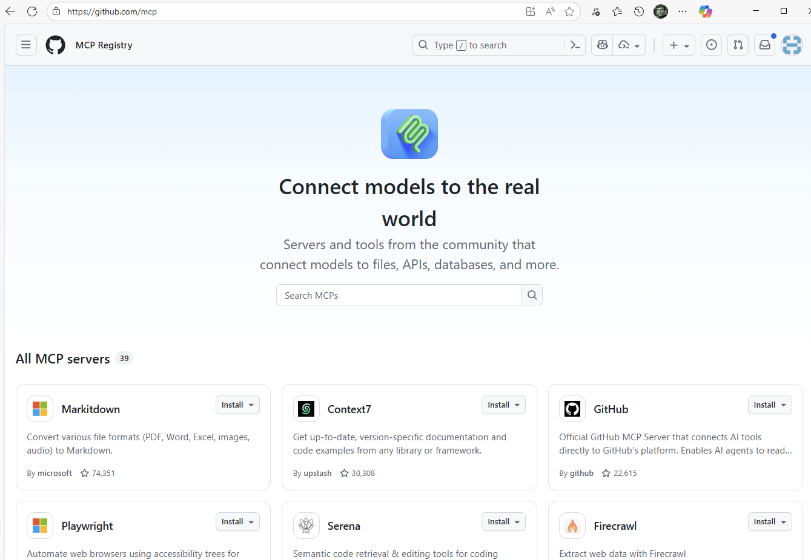

<!-- _class: titlepage -->

 Securing the Model Context Protocol

 secureai.se, Stockholm   

 Shaun Smith                       

 September 2025                                    

<table class="social-table">
  <tbody>
    <tr>
      <td></td>
      <td><a class="organization" href="https://huggingface.co/evalstate">huggingface.co/evalstate</a></td>
    </tr>
    <tr>
      <td></td>
      <td><a class="organization" href="https://github.com/evalstate">github.com/evalstate</a></td>
    </tr>
    <tr>
      <td></td>
      <td><a class="organization" href="https://x.com/evalstate">x.com/evalstate</a></td>
    </tr>
  </tbody>
</table>

<!-- -->

---

# Hello!

### Hugging Face MCP/Open Source Projects

### MCP Steering Committee Member

 

### `fast-agent.ai`

<!-- who knows about mcp, who i am, what the presentation entails -->

<!-- Community Moderator, Working Groups. -->

<!-- Work @ Hugging Face on MCP and Open Source initiatives. -->

<!-- if you are using MCP you are an LLM Systems integrator -->

---

<!-- _class: transition -->

# Model Context  Protocol

---

# Text Generation Models

 

Continues generating text from a prompt

 

---

<!-- _class: dataset-makeup -->

# Training Data Composition __Meta Llama 2023__

| Source | Content | Weighting | Size (GB) |
| --- | --- | --- | ---: |
| **🌐 English CommonCrawl** | English language web content | Very High (73.7%) | 3,379 |
| **🌐 C4** | Cleaned web pages | High (15.9%) | 783 |
| **💻 GitHub** | Open-source code | Medium (2.9%) | 328 |
| **📚 Wikipedia** | Encyclopedia articles in 20 languages | Medium (11.0%) | 83 |
| **📘 Books** | Project Gutenberg and Books3 collection | Medium (10.0%) | 85 |
| **🧪 ArXiv** | Scientific papers | Low (2.7%) | 92 |
| **💬 Stack Exchange** | Q&amp;A from various domains | Low (2.1%) | 78 |

Sizes normalized to gigabytes for straightforward comparisons.

---

# Token Prediction

<iframe class="web-embed" src="file:///X:/source/mikupad/mikupad.html" allowfullscreen loading="lazy" referrerpolicy="no-referrer"></iframe>

---

<!-- _class: completions-zoom -->

# Completions[0..1]

## Identical Prompt, Identical Model... 

---

# Privacy and Content

<!-- we trust providers to x,y,z -->

---

# Guardrails (and Prompt Engineering)

(donald trump clause)

https://docs.claude.com/en/release-notes/system-prompts#august-5-2025

## These are all things that LLM Systems Integrators need to consider.

---

Charles Dickens, A Tale of Two Cities : 206,022 Tokens (139,000 Words)

---

# Frozen weights, fleeting context

  

    <strong>Parameters stay resident</strong>
    
~60 GB loaded for inference at all times.

    
weights

    
Sharded across multiple accelerators to keep latency down.

    
~0.5 MB live context

  

  

    <strong>Context stream resets</strong>
    
131,072 tokens per turn (~95k words).

    
conversation

    <ul>
      <li>Rebuilt for every request.</li>
      <li>Tool outputs and prompts fight for headroom.</li>
      <li>Older turns vanish first when the window fills.</li>
    </ul>
  

Inference runs on a huge static memory map, while the conversational working set remains a tiny, constantly refreshed slice.

---

<!-- _class: transition -->

# Model Context Protocol is an open-source standard for connecting AI applications to external systems.

#### Think of MCP like a USB-C port for AI applications. Just as USB-C provides a standardized way to connect electronic devices, MCP provides a standardized way to connect AI applications to external systems.

---

# Solving a problem

## Interactive

- ### Copy/Paste Context Management
- ### Custom RAG Pipelines and Integrations

## Agents

- ### Plug and Play

---

# Architecture

---

<!-- _class: mcp-features -->

# MCP Server Capabilities

| Icon | Feature | Explanation | Example | 
| --- | --- | --- | --- | 
|  | Tools | Functions the model may call to act on the world: write to databases, invoke APIs, modify files,  workflows. | 
Send messages
 | Model |
|  | Resources | Read-only data sources like file contents, schemas, and documents that enrich prompts without. | 
Attach  documents
 | Application |
|  | Prompts | Instruction templates that steer the model to for specific workflows. | 
Draft an email
 | User |

---

<!-- _class: mcp-features -->

# MCP Client Primitives

| Icon | Feature | Explanation | Example | 
| --- | --- | --- | --- | 
|  | Roots | Specify which files and directories the Server can access | 
Share Local Files
 | Model |
|  | Sampling | Allow the MCP Server to request an LLM Completion. | 
Process unstructured data
 | Application |
|  | Elicitations | Request specific information from the User, bypassing the LLM | 
Collect specific booking information
 | User |

<!-- the name mcp server is a bit misleading -->

---

# Transports/Distribution __Dev Preview Nov 2024__

Protocol defines a minimum __how__ Client and Server connect and communicate, which official SDKs must support.

## STDIO (Local)

Run Locally (within the Host Process)
Running at User Privilege Level 
_Ad-hoc distribution_

## <strike>SSE (Remote)</strike>

<strike>

Remote Hosting (ex. Process)
Limited Host Application Support
_No standard authentication_
</strike>

---

# Locally Deployed Servers

- ### Usually started as a sub-process from the Host Application
- ### Access to local resources and files.
- ### Can execute commands on the Users computer
- ### Especially useful for Developer Tools
- ### Authentication through Config Files
- ### Updates, Usage and Telemetry Data can be difficult to capture +/-

---

# OAuth 2.1 and Streamable HTTP __2025-06-18__

- ## First Protocol update (__2025-03-26__) introduced a new Streamable HTTP Transport for Remote Servers and OAuth authentication.
- ## OAuth spec was revised to simplify implementation for MCP Server authors: 
  - ## No need to implement Authorization Server (easily use 3rd Party) 
  - ## Straightforward redirect from MCP Server so Client can handle authorization flow.
- ## First-Party Remote Servers will often have Privacy, Access policies in place. 
<!-- works really nicely demo HF MCP Integration -->

---

# Registries and MCP Bundle Format

### [registry.modelcontextprotocol.io](registry.modelcontextprotocol.io) 

Standardises MCP Server description format and provides a basic level of assurance.
<!-- Speak well of the community efforts here -->

### [MCP Bundle Format](https://github.com/anthropics/mcpb) (formerly DXT)

__MCPB__ archive distribution format for local MCP Servers to make __curation__, installation and update easier for End Users. 

 

---

# Registries and Curation

  

    <h3>MCP  Registries</h3>
    <ul>
      <li>
Trusted Sources (e.g. Claude MCP Partners)
</li>
      <li>
Managed MCP Enterprise Registry (e.g. Azure)
</li>
      <li>
Tool Integration (e.g. VSCode + GitHub)
   </ul>
  

  

    

      
      
      
    

  

---

# LLM Integration Risks - Lethal Trifecta

 

- ### Access to your private data—one of the most common purposes of tools in the first place!
- ### Exposure to untrusted content—any mechanism by which text (or images) controlled by a malicious attacker could become available to your LLM
- ### The ability to externally communicate in a way that could be used to steal your data

> Source: https://simonwillison.net/2025/Jun/16/the-lethal-trifecta/

 

---

# LLM Integration Risks - Context Management

- ### Function Calling includes Tool and Parameter descriptions to your Context.
- ### LLM not able to distinguish between intended, unintended and malicious instructions.
- ### Unused Tools / Servers degrade LLM Performance and increase inference costs.
- ### Exfiltration may not always appear obvious: _Host Application rendering_ of Images/Markdown/Mermaid links
- ### Tool can look safe on first run (pre-approval) but modify behaviour on second run.
- ### Tool Results may include unvetted data (e.g. Instructions embedded in a GitHub Issue or JIRA Ticket or Word Document).

<!-- similar risks exist for copy/paste context management -->

---

# MCP Specific Guidance

- ### Review Tool, Parameter and Instructions inclusion
- ### MCP Server `instructions` may be added to the Context.
- ### Multimodal Content (e.g. Images) returned via tools expose the same risks
- ### MCP Server Tool List Change Notifications - revalidation 
- ### Tools should not reference other Tools (especially NOT other MCP Servers) 
- ### Prioritise which things need Human-in-the-Loop 
- ### Risk assess specific Server/Tool mixes.

> (Read Ola's Post).

---

<!-- _class: transition -->

# Community and Contributing

---

# Getting Involved

- ### Open Source Specification and SDKs
- ### Recently updated governance model - in the open via SEP Process
- ### Active community discussions on Discord
- ### https://modelcontextprotocol.io/community
- ### https://github.com/modelcontextprotocol/
- ### Huge ecosystem of Open Source MCP Clients and Servers
- ### Explore Open Source Models, Datasets and Training Courses on MCP, LLMs and Transformers on https://huggingface.co
- ### Also use Open Source Models/Datasets

---

<!-- 

points to make here 
Models are trained using lots of text. 
Models were then trained to be conversational
Models were then trained to follow instructions
Models generate text using probabilities. [SHOW DEMO]

This isn't a long "history lesson" style talk; but i wanted to reground us 

Conversational Training. Hand Noted. RLHF. 
Instruction Training.

How do we make a model?
Ingredients. Lots of CPU, lots of compute.

Text Completions 

 given . The text we ask it to complete is known as the "Context".
Computational Complexity and Model Size.

The context is _tiny_ compared to the model
The context is precious
Instruction following has a precedence problem
Generations are intentionally different each time (completions[0])

-->

---

---

Assume that the data in your context window is privileged. 

The reason for the preamble is so that we can have a balanced discussion about MCP Security

<!-- launched in november last year, and immediately proved popular -->
<!-- why? for the first time rather than handling complex RAG or custom tool calling you had ready-made applications to integrate with 
## Part 3 - MCP

### Introduction

Can't deflect responsibility in to the Protocol
Can't transfer the risk

### Distribution

As Community Moderator get to see a lot of MCP Servers. One-shot prompted in to existence. 

Introducing the Model Context Protocol.

We see automation not augmentation.

So now that we know what a bit more about Models, and a bit more about Context let's see where MCP fits.
Show MCP-Webcam.

Less than 12 months old. Distribution Statistics. Weekend in Apr

- what mcp is -- do a deep dive explanation on the components and the parts.

- json-rpc; transports, hosts, client, servers.
- show all of the different datasources that can work.
- transport, data, layer??  (d)
- two specifications
OAUTH2.1
- Package and distribution of MCP-B/DXT. GitHub, Webiste.
- Registry

Bi-Directional Communication

co-minglign

-->
- Parts (MCP Servers, Host Application, Model)

- MCP Servers: Primitives
- MCP Servers: Connectivity
- MCP Servers: Priniciple of simple development
- Distribution Problem
- Remote Servers had no Authentication.

<!-- we'll do a high level walkthrough, then look at some of these in more detail -->
<!-- we talk a lot about MCP Servers, and that's not quite the right name -->
- Host
- Client
- Server
- LLM (Model/Context)
- User!

---

<!-- maybe i'm always tired of typing the same thing -->
<!-- maybe there's a website link the host application should follow -->

# Transports (and Distribution)

STDIO
SSE (Deprecated)
Streamable HTTP
The rise of Hosting Services and Proxies.

---

# Early days of MCP. Server List. 

Review the Server, make sure there are no obvious.

# What happens

MCP Server Instructions injected in to Context.
Auto-injection in to the Context.

Context co-mingling.
Data sent to the LLM 
Tools that know about each other

# Distribution

- StreamableHTTP gives deployment options, and the latest OAuth is intended to make integration easier.
- This makes deployment - and auditing easier. far better to have telemetry from your MCP Infrastructure than having people copy-paste from unknown sources.

---
