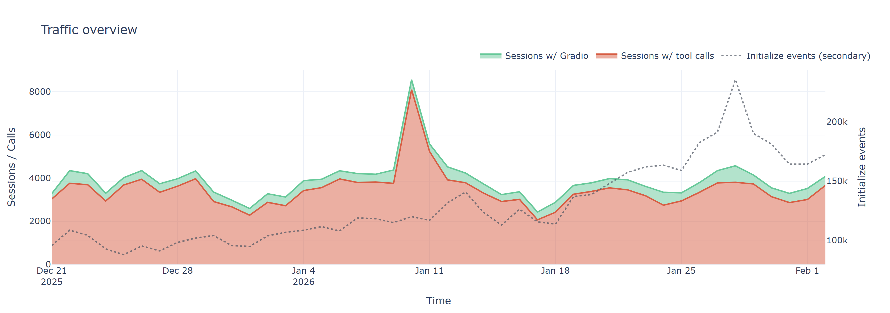
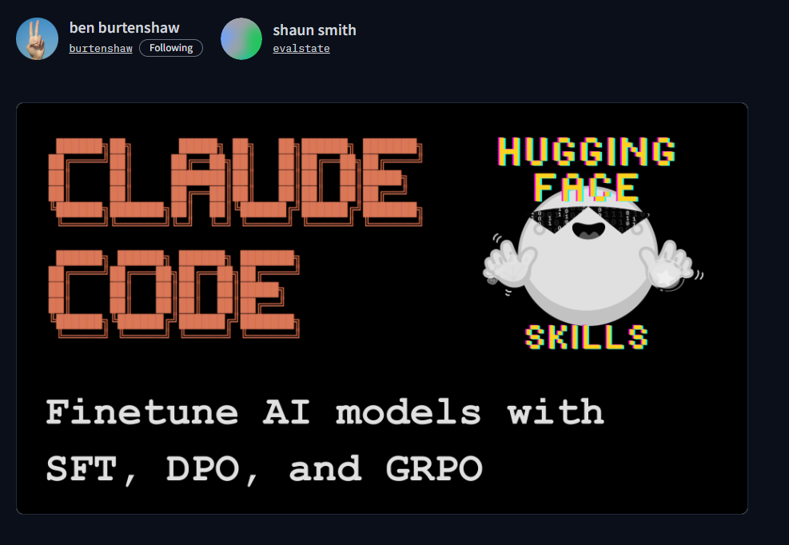
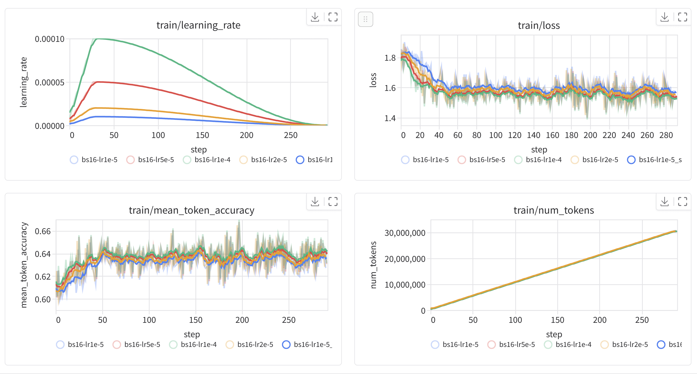
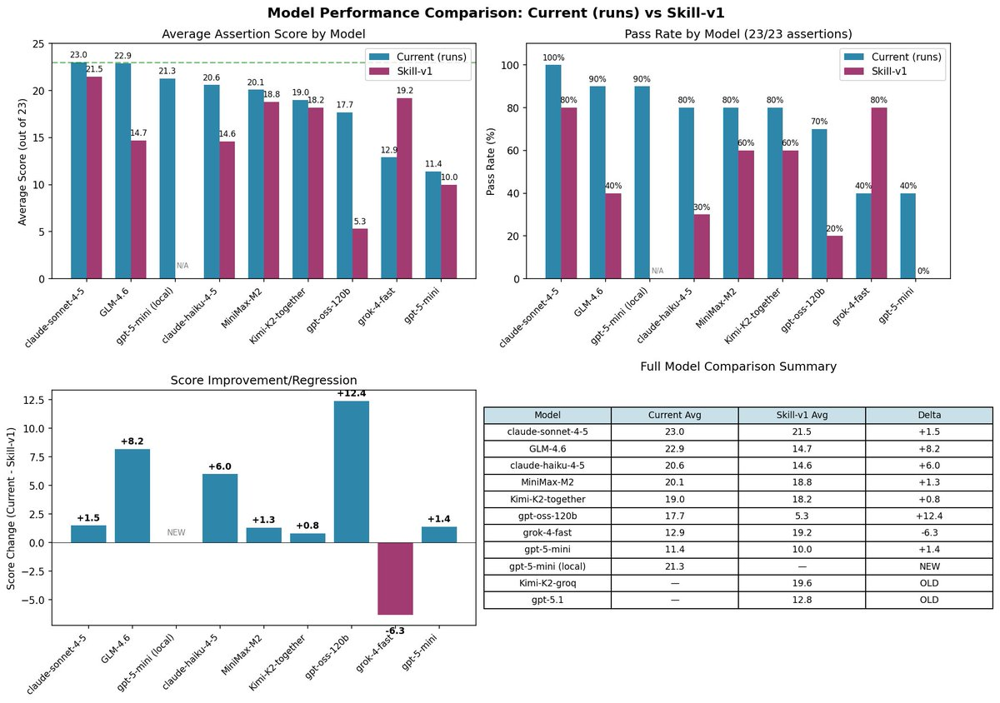

<style>
     .cite-author {  
      text-align        : right;
   }
   .cite-author:after {
      color             : orangered;
      font-size         : 125%;
      /* font-style        : italic; */
      font-weight       : bold;
      font-family       : Cambria, Cochin, Georgia, Times, 'Times New Roman', serif; 
      padding-right     : 130px;
   }
   .cite-author[data-text]:after {
      content           : " - "attr(data-text) " - ";      
   }

   .cite-author p {
      padding-bottom : 40px
   }

   /* Bottom-positioned wide image */
   .bottom-image {
     position: absolute;
     bottom: 20px;
     left: 50%;
     transform: translateX(-50%);
     width: calc(100% - 40px);
     max-width: 95%;
   }

   .bottom-image img {
     width: 100%;
     height: auto;
     object-fit: contain;
   }

   /* Alternative: Fixed to bottom with no padding */
   .bottom-image-flush {
     position: absolute;
     bottom: 0;
     left: 0;
     right: 0;
     width: 100%;
   }

   .bottom-image-flush img {
     width: 100%;
     height: auto;
     object-fit: contain;
   }

</style>

<script>
  (() => {
    const slideSelector = 'svg[data-marpit-svg]';
    const activeClass = 'bespoke-marp-active';

    const reloadIframes = (slide) => {
      const iframes = slide.querySelectorAll('iframe.demo');
      iframes.forEach((iframe) => {
        const baseSrc = iframe.dataset.baseSrc || iframe.getAttribute('src');
        if (!baseSrc) {
          return;
        }

        iframe.dataset.baseSrc = baseSrc;
        const separator = baseSrc.includes('?') ? '&' : '?';
        iframe.src = `${baseSrc}${separator}reload=${Date.now()}`;
      });
    };

    let lastActiveSlide = null;
    const handleSlideChange = () => {
      const activeSlide = document.querySelector(`${slideSelector}.${activeClass}`) ||
                          document.querySelector(`.${activeClass}${slideSelector}`);
      if (!activeSlide || activeSlide === lastActiveSlide) {
        return;
      }

      lastActiveSlide = activeSlide;
      reloadIframes(activeSlide);
    };

    const observeSlides = () => {
      const observer = new MutationObserver(handleSlideChange);
      document.querySelectorAll(slideSelector).forEach((slide) => {
        observer.observe(slide, { attributes: true, attributeFilter: ['class'] });
      });

      handleSlideChange();
      window.addEventListener('pageshow', handleSlideChange);
    };

    // Wait for bespoke to initialize
    const waitAndInit = () => {
      const slides = document.querySelectorAll(slideSelector);
      if (slides.length > 0) {
        observeSlides();
      } else {
        requestAnimationFrame(waitAndInit);
      }
    };

    if (document.readyState === 'complete') {
      waitAndInit();
    } else {
      window.addEventListener('load', waitAndInit, { once: true });
    }
  })();
</script>

<!-- _class: titlepage -->

<div class="title"         > Hugging Face: Connecting ML With Agents and Skills</div>
<div class="subtitle"      > MCP Conference, London   </div>
<div class="author"        > Shaun Smith                       </div>
<div class="date"          > February 2026                                    </div>
<table class="social-table">
  <tbody>
    <tr>
      <td></td>
      <td><a class="organization" href="https://huggingface.co/evalstate">huggingface.co/evalstate</a></td>
    </tr>
    <tr>
      <td></td>
      <td><a class="organization" href="https://github.com/evalstate">github.com/evalstate</a></td>
    </tr>
    <tr>
      <td></td>
      <td><a class="organization" href="https://x.com/evalstate">x.com/evalstate</a></td>
    </tr>
  </tbody>
</table>

---

<div class="columns">

<div>

# Shaun Smith `@evalstate`

- ### Open Source @ Hugging Face 
- ### MCP Maintainer / Transports WG
- ### huggingface/hf-mcp-server
- ### huggingface/upskill
- ### huggingface/skills
- ### huggingface.co/datasets/mcp-clients
- ### Maintainer of `fast-agent` 

</div>


<div class="center">


</div>


</div>


---


<video class="full-slide" src="./images/intro-spaces.webm" autoplay loop muted playsinline></video>

---

# HF Hub MCP Server API Activity (from Jun 2025)

<center>


</center>


---

# What's going on??

<div class="columns">


<div>

## *Initialize Requests?*
- ### 1% MCP Traffic -> Tool Call
- ### Unreliable proxy for MCP install

## *Tool Calls: More != Better*
- ### Human vs. Agent usage... high call rate may indicate failure.

## *Sessions with > 1 Tool Call*
- ### 2% Conversion rate from Initialize

</div>

<div>

<center>


</center>

</div>

</div>


<!-- Initialize Events might tell us whether someone has the MCP Server installed -->
<!-- Raw Tool Calls is a potentially misleading vanity metric -->
<!-- Sessions that convert to at least one tool call --> 
<!-- typical ratio is 1.77% of initialize events are "interesting" -->

---

# Last 6 weeks of activity

<center>



</center>


---

# Open Source Client Data (HF Hub MCP)!!

## https://huggingface.co/datasets/evalstate/mcp-clients


<center>


</center>


---

# Dynamic Spaces and MCP for Inference

<!-- _class: transition -->

---

# MCP Features


<div class="columns">

<div>

- ## Inference Gateway

- ## Dynamic Model Selection

- ## Customisable Behaviour

- ## JSON-RPC/SSE Responses

- ## Tool Progress Notifications


</div>

<div class="no-shadow">

<center>


</center>

```typescript
async (request, extra) => {
  await server.notification({
    method: "notifications/statusUpdate",
    params: { /* your params */ }
  }, { relatedRequestId: extra.requestId });
};

```

</div>

</div>

---


# Bifurcating MCP
# People, Agents, Skills -> Code Mode

<!-- _class: transition -->

---

# Hugging Face Skills


<div class="columns">

<div>

<center>



</center>


- ## Model Training
- ## Sandboxes & Datasets
- ## *Tool Building*


</div>

<div>

### `github.com/huggingface/skills`


</div>

</div>

---

# UPskill `github.com/huggingface/upskill`


<div class="columns" style="grid-template-columns: 70% 30%;" >

<div>



</div>

<div>

### Generate and evaluate Skill peformance across different LLMs 


</div>

</div>


---

# Agents with ACP

<!-- _class: transition -->


---

<!-- _class: transition -->

<div style="position: absolute; top: 25%; left: 50%; transform: translateX(-50%); text-align: center; width: 90%; z-index: 10;">

# Thank You!

<div style="display: flex; align-items: center; justify-content: center; gap: 20px; margin-top: 80px;">
  
  <span style="font-size: 2.5em; font-weight: bold;">github.com/evalstate</span>
</div>

</div>

<div class="bottom-image-flush no-shadow">


</div>
