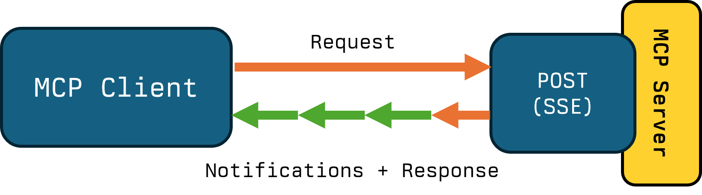
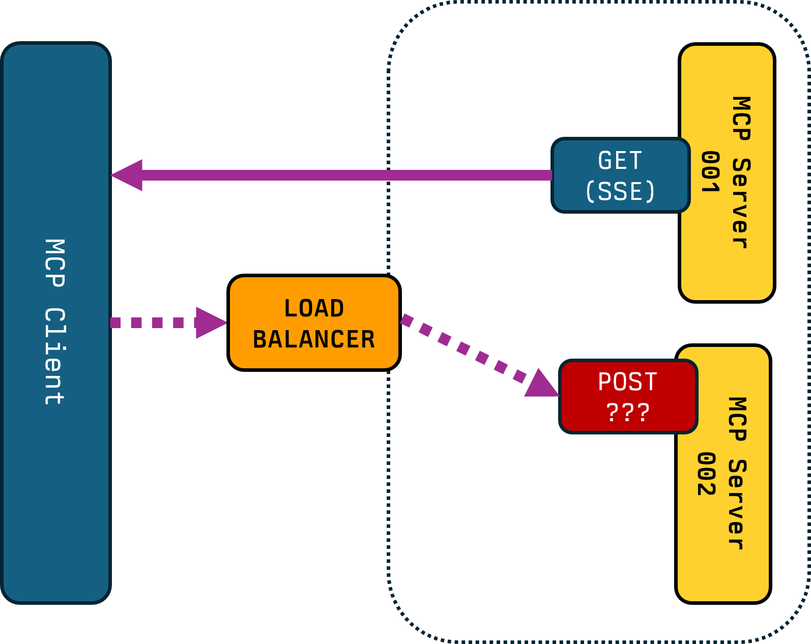

3 parts

Hugging Face
 - At Hugging Face we host 1000s of MCP Servers 
 - Hugging Face. 
 - MCP As interop
 - Overview of traffic
 - Multimodal inference jobs (& Gradio API). Machine Learning applications 
 - LSP -> reality is different.

Transports > 1 year in
 - Open Source dataset of Client implementation details
 - Low takeup of features
 - STDIO nibbled away by CLI/Skills.
 - MCP Apps
 - Complexity (e.g. incorrect configs)
 - (demo of )
 - robustness of agent loops
 - Not a great experience for Agents. Robustness, handling persistent containers. 
 - Get ready for the next wave of scale (driven by Agents and MCP Apps)
 - Deprecated Legacy SSE

The future
 - Stateless
    - Remove initialize step
    - stateless; whether they return a session id  - not actually a change in behaviour
    - < Diagram here is Mark Roth / KVG but simpler>


 - Sessions
   Problem: Sessions are poorly defined, and a side effect to transport
   Solution: Cookie Jar allows maintaining. Include data in the JSON envelope.
   Why: Allow session based behaviours. Server will issue cookies, clients can respond.

 - HTTP Header Duplication
   Problem: Standard internet routing infrastructure not MCP Aware (JSON Packet Inspection)
   Solution: Put important information in the HTTP Headers for the HTTP Transport.
   Why: Reuse existing infrastructure.

- 

---

<style>
     .cite-author {  
      text-align        : right;
   }
   .cite-author:after {
      color             : orangered;
      font-size         : 125%;
      /* font-style        : italic; */
      font-weight       : bold;
      font-family       : Cambria, Cochin, Georgia, Times, 'Times New Roman', serif; 
      padding-right     : 130px;
   }
   .cite-author[data-text]:after {
      content           : " - "attr(data-text) " - ";      
   }

   .cite-author p {
      padding-bottom : 40px
   }

   /* Bottom-positioned wide image */
   .bottom-image {
     position: absolute;
     bottom: 20px;
     left: 50%;
     transform: translateX(-50%);
     width: calc(100% - 40px);
     max-width: 95%;
   }

   .bottom-image img {
     width: 100%;
     height: auto;
     object-fit: contain;
   }

   /* Alternative: Fixed to bottom with no padding */
   .bottom-image-flush {
     position: absolute;
     bottom: 0;
     left: 0;
     right: 0;
     width: 100%;
   }

   .bottom-image-flush img {
     width: 100%;
     height: auto;
     object-fit: contain;
   }

</style>

<!-- _class: titlepage -->

<div class="title"         > Connecting Context: Future Transports</div>
<div class="subtitle"      > MCP Connect, Paris   </div>
<div class="author"        > Shaun Smith                       </div>
<div class="date"          > February 2026                                    </div>
<table class="social-table">
  <tbody>
    <tr>
      <td></td>
      <td><a class="organization" href="https://huggingface.co/evalstate">huggingface.co/evalstate</a></td>
    </tr>
    <tr>
      <td></td>
      <td><a class="organization" href="https://github.com/evalstate">github.com/evalstate</a></td>
    </tr>
    <tr>
      <td></td>
      <td><a class="organization" href="https://x.com/evalstate">x.com/evalstate</a></td>
    </tr>
  </tbody>
</table>


<!-- -->

---

<div class="columns">

<div>

# Shaun Smith `@evalstate`

- ### @ Hugging Face MCP
- ### MCP Maintainer / Transports WG
- ### Maintainer of `fast-agent` 

</div>


<div class="center">


</div>


</div>


---

# MCP at Hugging Face

- Host over 2,500 MCP Servers (Gradio/ML Applications)
- Hub MCP Server (configurable)
- Chat UI, Remote MCP, Agents

---

# Traffic Patterns

- Tool Calls (More Tool Calls != Better)
- Initialize Events (Maybe equals installation)
- Sessions with Tool Calls

<!-- Initialize Events might tell us whether someone has the MCP Server installed -->
<!-- Raw Tool Calls is a potentially misleading vanity metric -->
<!-- Sessions that convert to at least one tool call --> 
<!-- typical ratio is 1.77% of initialize events are "interesting" -->


---

# Streamable HTTP — Dual Cluster

<iframe src="./animations/http-dual-cluster.html" width="100%" height="480" style="border: none; border-radius: 16px; background: transparent;"></iframe>

---

# Streamable HTTP — Multinode

<iframe src="./animations/http-multinode.html" width="100%" height="480" style="border: none; border-radius: 16px; background: transparent;"></iframe>

---

# Stdio — Simple

<iframe src="./animations/stdio-simple.html" width="100%" height="480" style="border: none; border-radius: 16px; background: transparent;"></iframe>

---


---

# LSP and MCP

<div class="columns" style="grid-template-columns: 40% 60%;">

<div>

MCP was Inspired by Language Server Protocol used by IDEs.

</div>


<iframe src="./animations/stdio-simple.html" width="100%" height="420" style="border: none; border-radius: 16px; background: transparent;"></iframe>

</div>

</div>

---

# Clustered MCP Servers

---


<!-- _class: transition -->

# Change 1:  Stateless Protocol

---

<div style="text-align: center; font-size: 22px; font-weight: 600; margin-bottom: 6px;">Stateless protocol (capabilities per request)</div>

<iframe src="./animations/http-multinode-stateless.html" width="100%" height="520" style="border: none; border-radius: 16px; background: transparent;"></iframe>

---

<!-- _class: transition -->

# Change 2: - Multi Round Trip Requests


---

<div style="text-align: center; font-size: 22px; font-weight: 600; margin-bottom: 6px;">Multi-round trip flow + stateful request</div>

<div class="columns">

<div>

<iframe src="./animations/mcp-mrtr-flow.html" width="100%" height="500" style="border: none; border-radius: 16px; background: transparent;"></iframe>

</div>

<div>

<iframe src="./animations/mcp-stateful-request.html" width="100%" height="500" style="border: none; border-radius: 16px; background: transparent;"></iframe>

</div>

</div>


---

<div style="text-align: center; font-size: 22px; font-weight: 600; margin-bottom: 6px;">Chat interaction vs API payload</div>

<div class="columns">

<div>

<iframe src="./animations/chat-demo.html" width="100%" height="480" style="border: none; border-radius: 16px; background: transparent;"></iframe>

</div>

<div>

<iframe src="./animations/chat-api-view.html" width="100%" height="480" style="border: none; border-radius: 16px; background: transparent;"></iframe>

</div>

</div>


---

<div style="text-align: center; font-size: 22px; font-weight: 600; margin-bottom: 6px;">MRTR flow + accumulated request</div>

<div class="columns">

<div>

<iframe src="./animations/mcp-mrtr-flow.html" width="100%" height="500" style="border: none; border-radius: 16px; background: transparent;"></iframe>

</div>

<div>

<iframe src="./animations/mcp-mrtr-request.html" width="100%" height="500" style="border: none; border-radius: 16px; background: transparent;"></iframe>

</div>

</div>


---

# Transport Features

---

# Transport Practices

---


 - MRTR
   Problem: Server->Client Requests are stateful.
   Solution: Accumulate Requests/Responses. Consider deprecating "unsolicited ". 
   Why: Timeouts, Deployments
   - < Diagram here is showing chat messages -> MCP elicitation >

---


---

# Adding Tool Progress Notifications

<div class="columns">

<div>

### Longer running Tools (like Image Generation) can send __Progress Notifications__.

### MCP Server responds to the `POST` Request with an `SSE` Stream.

### Server Streams notifications to Client, then the Response, and closes.

<div class="emphasis-box">

MCP Server developer should make sure Notifications are sent on the correct channel.

</div>

</div>

<div class="no-shadow">

<center>



</center>

```typescript
async (request, extra) => {
  await server.notification({
    method: "notifications/statusUpdate",
    params: { /* your params */ }
  }, { relatedRequestId: extra.requestId });
};

```

```python
await session.send_progress_notification(
    progress_token="token-789",
    progress=50,
    related_request_id="tool-call-456"  
)
```


</div>

</div>

---


---


---


---

# Using `Mcp-Session-Id`


---

# `Mcp-Session-Id` for Conversational State?


---

# `Mcp-Session-Id` for Routing

<div class="columns">

<div class="no-shadow">



</div>

<div>

### With Multiple MCP Server instances, _Client to Server Responses_ needs to go the correct Server.

### `Mcp-Session-Id` HTTP Header can be used for Routing to the correct Server (sticky sessions).

### Sharing `Mcp-Session-Id` state amongst the cluster is not enough: Both `Mcp-Session-Id` and Elicitation `RequestId` are needed for correlation.

</div>

</div>


---

---


---


---


---


---

# Some pain points

- ### `GET` Handler: For Interactive Hosts it's expensive (especially for speculative Tool Change Notifications). For Transactional Hosts it's unnecessary. Can be used for SSE Failure resumption - hard in practice. Management in elastic environments tricky.
- ### MCP Protocol Overhead - JSON-RPC Packaging requires inspection for Processing and Return - prohibiting standard HTTP Caching. Protocol is "Chatty" in practice.
- ### Sessions are coupled to the Transport implementation and State. Deploying in a Cluster means Sticky Sessions. Server Initiated Requests must be identified by both  `Mcp-Session-Id + JSON-RPC-RequestId`
- ### Timeout Handling - Progress Notifications resetting HTTP timeouts for example is not consistent Client behaviour.

---


# Transport WG / Relevant SEPs

- ## Handle inconsistencies between transports
- ## Separate JSON-RPC layer from Protocol Data Layer.
- ## SEP #1442 - Make MCP Stateless by Default: Move State captured in Initialize to Request/Response cycle.

- ## Pure HTTP Transport - `https://github.com/mikekistler/pure-http-transport`


---

<!-- _class: transition -->

### _Thanks to the Transport Working Group_


<!-- _class: biblio -->


1. Everything Server PR 1: https://github.com/modelcontextprotocol/servers/pull/2789
1. Everything Server PR 2: https://github.com/modelcontextprotocol/servers/pull/2672
1. Hugging Face MCP Server: https://huggingface.co/mcp
1. MCP community Working Groups https://modelcontextprotocol-community.github.io/working-groups/

---
