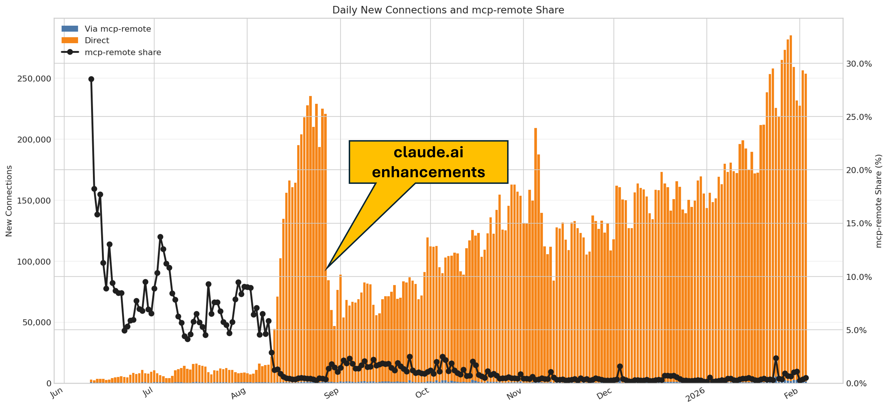
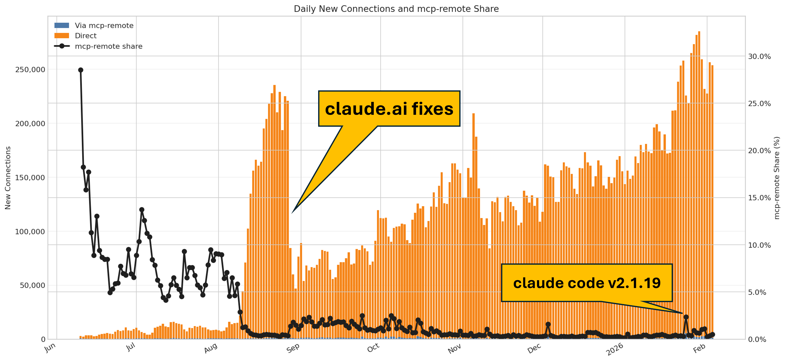
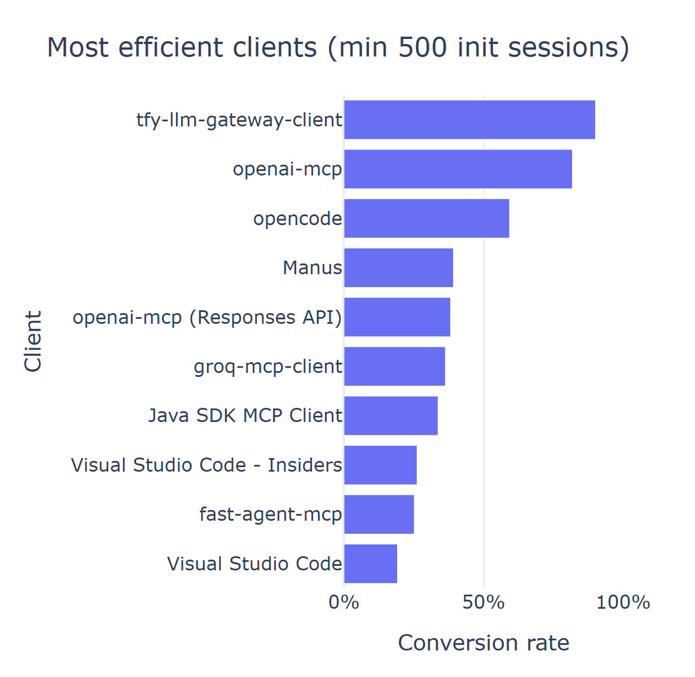
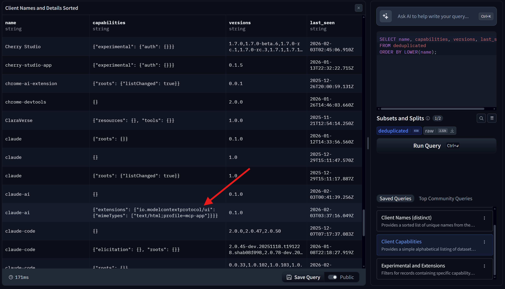

<!-- _class: titlepage -->

 Connecting Context: Future Transports

 MCP Connect, Paris   

 Shaun Smith                       

 February 2026                                    

<table class="social-table">
  <tbody>
    <tr>
      <td></td>
      <td><a class="organization" href="https://huggingface.co/evalstate">huggingface.co/evalstate</a></td>
    </tr>
    <tr>
      <td></td>
      <td><a class="organization" href="https://github.com/evalstate">github.com/evalstate</a></td>
    </tr>
    <tr>
      <td></td>
      <td><a class="organization" href="https://x.com/evalstate">x.com/evalstate</a></td>
    </tr>
  </tbody>
</table>

---

# Shaun Smith `@evalstate`

- ### Open Source @ Hugging Face 
- ### MCP Maintainer / Transports WG
- ### huggingface/hf-mcp-server
- ### huggingface/upskill
- ### huggingface/skills
- ### huggingface.co/datasets/mcp-clients
- ### Maintainer of `fast-agent` 

---

<video class="full-slide" src="./images/intro-spaces.webm" autoplay loop muted playsinline></video>

---

# HF Hub MCP Server API Activity (from Jun 2025)

---

# HF Hub MCP Server API Activity (from Jun 2025)

---

# What's going on??

## Initialize Requests?
- ### 1% MCP Traffic -> Tool Call
- ### Unreliable proxy for MCP install

## Tool Calls: More != Better
- ### Human vs. Agent usage. High Call rate may indicate failure.

## *Sessions with at least 1 Tool Call*
- ### 2% Conversion rate from initialize

<!-- Initialize Events might tell us whether someone has the MCP Server installed -->
<!-- Raw Tool Calls is a potentially misleading vanity metric -->
<!-- Sessions that convert to at least one tool call --> 
<!-- typical ratio is 1.77% of initialize events are "interesting" -->

---

# Last 6 weeks of activity

---

# Open Source Client Data!!

## https://huggingface.co/datasets/evalstate/mcp-clients

---

# Preparing MCP for the future

<!-- _class: transition -->

<!--

## Robust Agent Loops of hundreds of turns

## Adoption of MCP Apps at Internet Scale 

## Create, control and manage Resources

-->

---

# Preparing MCP for the future

<iframe class="demo" loading="lazy" src="./animations/stdio-simple.html"></iframe>

---

<!-- _class: transition -->

# Change 1:  Stateless Protocol

---

Future Protocol - No Initialize, Capabilities with Request/Response Pair

<iframe class="demo" loading="lazy" src="./animations/http-multinode-stateless.html"></iframe>

<!-- discoverable with a "discovery" endpoint -->

---

Current Protocol - Stateful Connection

<iframe class="demo" loading="lazy" src="./animations/http-multinode.html"></iframe>

---

Sampling and Elicitation

<iframe class="demo" loading="lazy" src="./animations/http-multinode-shared-storage.html"></iframe>

---

<!-- _class: transition -->

# Change 2: - Multi Round Trip Requests

---

Current Protocol - Needs to manage Request Id

<iframe class="demo" loading="lazy" src="./animations/http-multinode-shared-storage.html"></iframe>

---

Multi-round trip flow + stateful request

<iframe class="demo demo--column" loading="lazy" src="./animations/mcp-mrtr-flow.html"></iframe>

<iframe class="demo demo--column" loading="lazy" src="./animations/mcp-stateful-request.html"></iframe>

---

Chat interaction vs API payload

<iframe class="demo demo--column" loading="lazy" src="./animations/chat-demo.html"></iframe>

<iframe class="demo demo--column" loading="lazy" src="./animations/chat-api-view.html"></iframe>

---

MRTR flow + accumulated request

<iframe class="demo demo--column" loading="lazy" src="./animations/mcp-mrtr-flow.html"></iframe>

<iframe class="demo demo--column" loading="lazy" src="./animations/mcp-mrtr-request.html"></iframe>

---

<!-- _class: transition -->

# Change 3: Real Sessions (Cookies)

---

MCP cookies for session semantics

<iframe class="demo" loading="lazy" src="./animations/http-multinode-cookie.html"></iframe>

---

# Supporting Changes

## Duplication of JSON-RPC content within HTTP Headers.

## Clarification of Sampling / Elicitation usage:

---

# Transport WG / Relevant SEPs

- ## Handle inconsistencies between transports
- ## Separate JSON-RPC layer from Protocol Data Layer.
- ## SEP #1442 - Make MCP Stateless by Default: Move State captured in Initialize to Request/Response cycle.

- ## Pure HTTP Transport - `https://github.com/mikekistler/pure-http-transport`

---

---

<!-- _class: transition -->

### _Thanks to the Transport Working Group_

<!-- _class: biblio -->

1. Everything Server PR 1: https://github.com/modelcontextprotocol/servers/pull/2789
1. Everything Server PR 2: https://github.com/modelcontextprotocol/servers/pull/2672
1. Hugging Face MCP Server: https://huggingface.co/mcp
1. MCP community Working Groups https://modelcontextprotocol-community.github.io/working-groups/

---

# Streamable HTTP — Dual Cluster

<iframe class="demo" loading="lazy" src="./animations/http-dual-cluster.html"></iframe>

---
