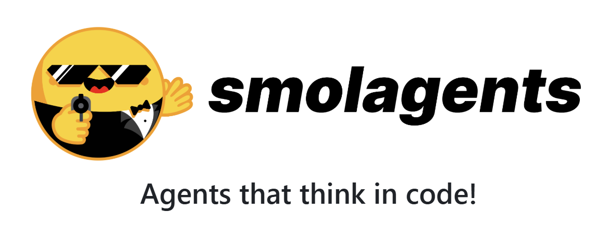
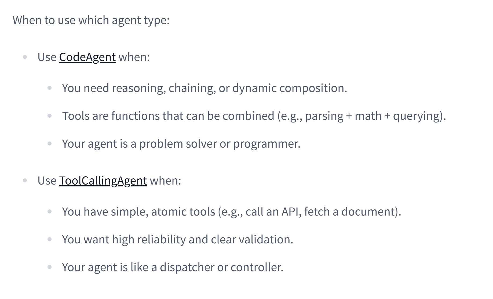

<!-- _class: titlepage -->

MCP Dev Summit · New York · 2026

MCP at 18 Months

Protocols, patterns, and the things we did not see coming. Draft deck scaffold built from <code>./preps/</code>, with a stronger visual system and room to tune the narrative.

Shaun Smith · <code>@evalstate</code>

March 2026 draft

<table class="social-table">
  <tbody>
    <tr>
      <td></td>
      <td><a class="organization" href="https://huggingface.co/evalstate">huggingface.co/evalstate</a></td>
    </tr>
    <tr>
      <td></td>
      <td><a class="organization" href="https://github.com/evalstate">github.com/evalstate</a></td>
    </tr>
    <tr>
      <td></td>
      <td><a class="organization" href="https://x.com/evalstate">x.com/evalstate</a></td>
    </tr>
  </tbody>
</table>

---

Opening position

# The debate about MCP is more interesting than MCP

That is not a problem. It is a sign that the protocol earned a place in the stack, enough that people now argue about what should stay stable, what should move up-stack, and what belongs somewhere else entirely.

  
<strong>PMF</strong>Parts of the protocol clearly found it. Others are still negotiating fit.

  
<strong>Pressure</strong>Reasoning models, code mode, remote execution, and OAuth all changed the operating environment.

  
<strong>Shift</strong>Tools are no longer the whole story. Execution environments now matter just as much.

  
<strong>Goal</strong>Explain what endured, what changed, and why the next layer matters.

---

Speaker context

# Shaun Smith `@evalstate`

- Open Source @ Hugging Face
- MCP maintainer / transports working group
- `huggingface/hf-mcp-server`
- `huggingface/upskill`
- `huggingface/skills`
- Maintainer of `fast-agent`

---

<!-- _class: transition -->

# What did not exist when MCP launched?

---

  

    <h3>Reasoning changed expectations</h3>
    
Reasoning models, explicit tool loops, and longer-lived planning made “simple call-and-return” feel incomplete almost overnight.

  

  

    <h3>Code mode became real</h3>
    
Claude Code, Goose, and similar systems normalized search/execute patterns, lightweight sandboxes, and task-specific environments.

  

  

    <h3>Remote execution matured</h3>
    
Streamable HTTP, OAuth, hosted sandboxes, and remote MCP made distribution less of a curiosity and more of an operating model.

  

  

    <h3>Skills became a product surface</h3>
    
<code>AGENTS.md</code>, agent skills, and reusable bash or code workflows gave us portable behavior, not just portable APIs.

  

  

    <h3>Inference APIs expanded</h3>
    
Responses-style APIs started to absorb execution, state, search, and schema control, blurring lines that once looked fixed.

  

  

    <h3>Local models got practical</h3>
    
Smaller and faster local models changed which tasks deserve expensive model hops and which can stay close to the environment.

  

---

Thesis

# MCP got product-market fit by being too big first

  

    <h3>What survived</h3>
    <ul>
      <li>Tool discovery and standardized invocation</li>
      <li>Authentication and remote access patterns</li>
      <li>Resources where data locality matters</li>
      <li>A shared language for clients, servers, and operators</li>
    </ul>
  

  

    <h3>What the market is still testing</h3>
    <ul>
      <li>How much runtime should live in the protocol</li>
      <li>Whether prompts and sampling belong in the common path</li>
      <li>How rich server-hosted UI should become</li>
      <li>What execution should live with the client vs inference backend</li>
    </ul>
  

<blockquote>

The interesting story is not that MCP had many ideas. It is that the ecosystem selected a useful subset through actual usage pressure.

</blockquote>

---

Economics

# MCP servers are not just “tool wrappers”

- The winning remote servers provide something you do **not** already have:
  - access to protected data
  - access to compute
  - aggregation and preprocessing
  - policy and access control
- That makes hosting economics legible.
- It also explains why plain API wrapping is sometimes fine and sometimes obviously thin.

  
Servers become durable when they are gateways to scarce resources, not just alternate syntax for an existing HTTP call.

  <small>Distribution and hosting thesis</small>

---

Agentic reality

# Agents are a hack — but a useful one

- Agents are often a <strong>context management strategy</strong> more than a metaphysical breakthrough.
- They let us specialize models, isolate tool loops, and control expensive inference boundaries.
- The practical question is not “are agents real?” but:
  - where does the loop run?
  - who owns state?
  - what should be terminal for the user?
  - what deserves another model pass?

This is a strong candidate for a live rewrite once the exact audience and talk length are fixed.

---

RL and behavior shaping

# Reinforcement learning made environments first-class

- Place the model in an environment.
- Reward useful trajectories.
- Let it search, try, fail, and recover.
- Suddenly shell, code execution, and reusable skills are no longer awkward escape hatches — they are training-compatible behavior surfaces.

---

Skills

# Shell is code too

- Bash loops can be compact, expressive, and very efficient.
- Skills package reusable procedures, not just reusable endpoints.
- Models that can compose or generate code tools change how often we need bespoke MCP servers.
- That does not reduce MCP’s importance; it sharpens where it adds value.

---

Deployment choices

# Where should code mode actually run?

  

    <h3>On the client</h3>
    
Fast feedback, strong local context, but a heavier trust and environment burden on the user.

  

  

    <h3>Inside a sandbox</h3>
    
Cleaner isolation and reproducibility, especially for task-specific agents and generated tools.

  

  

    <h3>At the inference provider</h3>
    
Potentially cheaper orchestration, but more coupling between model API and execution semantics.

  

  
<strong>Local</strong>Best when context and trust already live with the user.

  
<strong>Remote</strong>Best when compute, policy, or shared tooling matter.

  
<strong>Embedded</strong>Best when inference APIs absorb code, search, and tool loops.

  
<strong>Hybrid</strong>Probably where most serious systems end up.

---

Failure mode

# Models are not trained on JSON alone

- Chat templates still break tool calling in subtle ways.
- Over-normalized tool schemas can make outputs worse, not better.
- Grammar constraints help, but only if they align with the model’s learned behavior.
- We should stop assuming that JSON purity automatically means better agent execution.

  
The ecosystem’s JSON fixation is often a tooling preference disguised as a model truth.

  <small>Worth tightening with one concrete example</small>

---

Terminal tool calls

# Apps SDK and generative UI matter for the same reason

- Many tool calls are <strong>terminal for the user</strong>.
- Once the right data is retrieved, another expensive model pass may add delay, cost, and distortion.
- UI surfaces let us present rich results directly to the user instead of laundering everything back through tokens.

---

Protocol adjacency

# ACP and Open Responses are both telling us something

  

    <h3>Agent Client Protocol</h3>
    <ul>
      <li>Distributes agent experiences, not just tool access</li>
      <li>Sessions, streaming, rehydration, observability</li>
      <li>Good fit when UX continuity matters</li>
      <li>Natural partner to MCP in richer client stacks</li>
    </ul>
  

  

    <h3>Open Responses / inference APIs</h3>
    <ul>
      <li>Normalize model-side execution surfaces</li>
      <li>Can absorb search, code, remote tools, and state</li>
      <li>Good fit when provider-managed orchestration is desirable</li>
      <li>Pressure-test what should remain protocol-neutral</li>
    </ul>
  

---

Visual callback

# Things we absolutely did not have

These are intentionally rough placeholders from <code>./preps/</code>; swap with cleaner screenshots once the talk is locked.

---

Closing

# MCP earned its place — now the boundary drawing starts

  

    <h3>Core claim</h3>
    <ul>
      <li>MCP succeeded by standardizing enough of the stack to let real usage reveal the useful parts.</li>
      <li>The next debate is not whether MCP matters. It is where protocol stops and environment begins.</li>
      <li>Execution, skills, remote hosting, and UI are now part of the same system design conversation.</li>
    </ul>
  

  

    <h3>Open decisions for this deck</h3>
    <ul>
      <li>How HF-specific should the examples be?</li>
      <li>Do we want more economics or more protocol futures?</li>
      <li>Is this a 20 minute talk or a 30 minute talk?</li>
    </ul>
  

---

<!-- _class: transition -->

# Questions

### and which side of the boundary do we want to defend?
