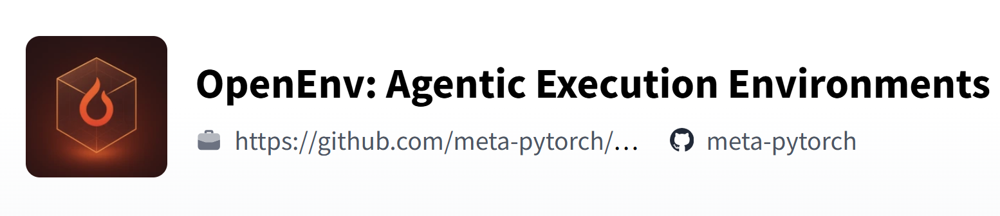
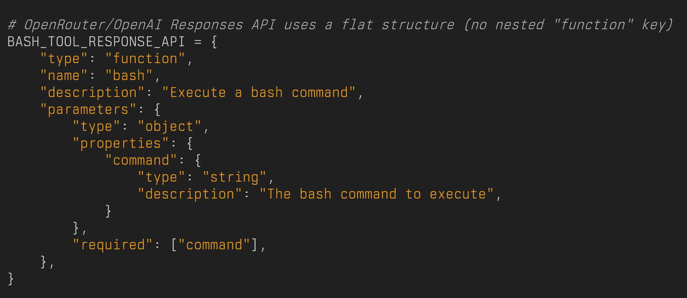
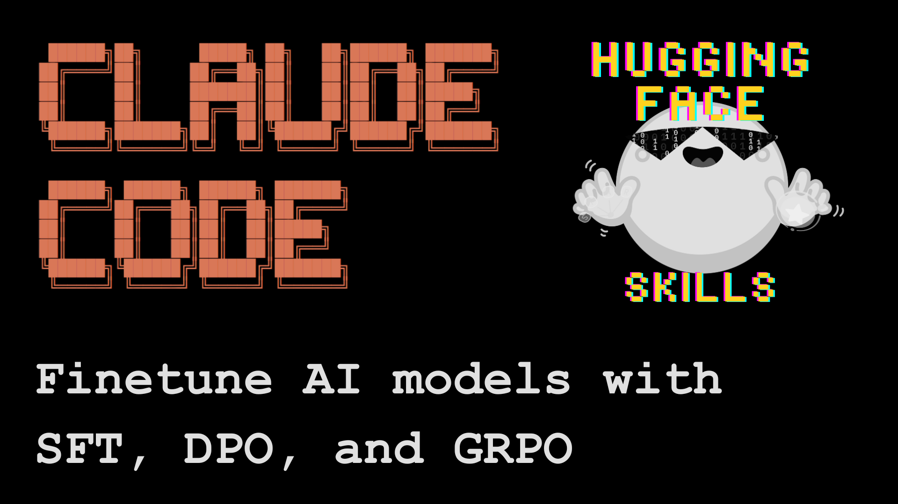
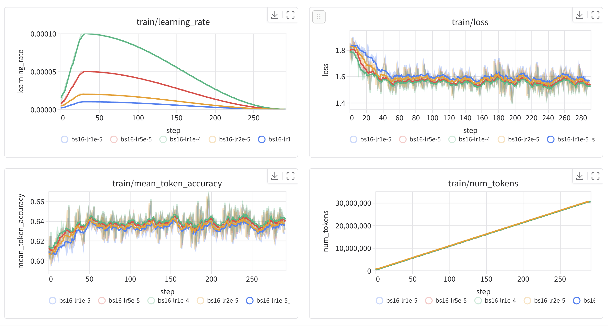
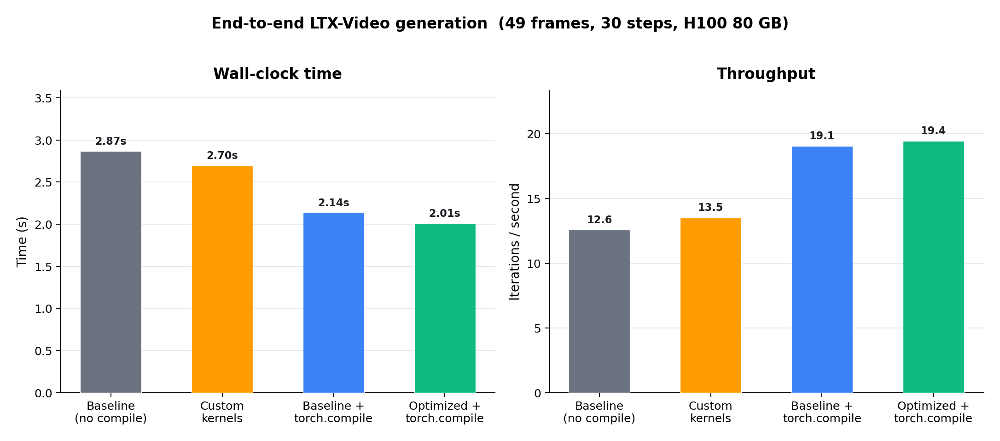
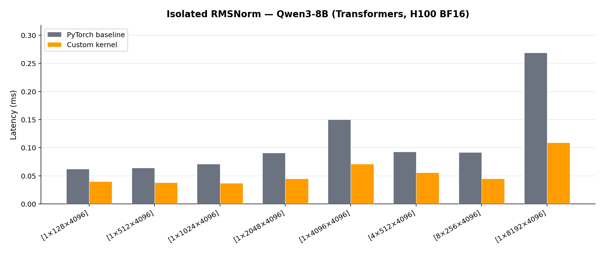

<!-- _class: titlepage -->

AINativeDev · London · 2026

Upskilling Models, Agents and the ML Pipeline

Shaun Smith · <code>@evalstate</code>

April 2026

<table class="social-table">
  <tbody>
    <tr>
      <td></td>
      <td><a class="organization" href="https://huggingface.co/evalstate">huggingface.co/evalstate</a></td>
    </tr>
    <tr>
      <td></td>
      <td><a class="organization" href="https://github.com/evalstate">github.com/evalstate</a></td>
    </tr>
    <tr>
      <td></td>
      <td><a class="organization" href="https://x.com/evalstate">x.com/evalstate</a></td>
    </tr>
  </tbody>
</table>

---

# Shaun Smith `@evalstate`

- Open Source @ Hugging Face
- MCP Maintainer [Transports] / Community Moderator
- `huggingface/hf-mcp-server`
- `huggingface/upskill`
- `huggingface/skills`
- Maintainer of `fast-agent`

  
  

    
  

---

<video class="full-slide" src="./images/intro-spaces.webm" autoplay loop muted playsinline></video>

---

<!-- _class: transition -->

# The evolution of Tool Calling....

---

# Things we didn't have 18 Months ago...

  

    
  

  

    <h3>MCP Streamable HTTP Transport and OAuth</h3>
  

  

    <h3>AGENTS.MD and Agent Skills</h3>
  

  

    <h3>Internal Tools in Inference APIs</h3>
  

  

    <h3>Agent Client Protocol 
    Responses API</h3>
  

  

    <h3>Long Running Tool Loops (and reasoning models)</h3>
  

---

# Reinforcement Learning 

  

Models are placed in an environment, given a task and scored with a reward function:

  - <strong>discover</strong>
  - <strong>self-correct</strong>
  - <strong>problem solve</strong>
  - keep <strong>driving the loop</strong> without constant human steering

> mini-SWE-Agent: A single 100 line python and single freeform (non JSON) tool can score 76.0% on SWE-Bench!

It's hard to compete against that efficiency.

  

  

    
    
  

---

# Smaller and Simpler Harnesses

- General-purpose agent harnesses are given direct(*) shell access
- Fewer pre/post tool and LLM stop checks to keep models on track
- API surface and Custom Workflows replaced by Model capabilities
- Snapshot and checkpointing techniques
- Movable runtime environments
- Scripting (code generation) allows immediate specialization

---

# Skill Driven Agents 

<svg class="nia-flow-svg" viewBox="0 0 1120 390" role="img" aria-label="Task flows to Navigate, Ingest, Act, then loops back to Task">
<defs>
<linearGradient id="nia-blue-line" x1="0%" x2="100%" y1="0%" y2="0%">
<stop offset="0%" stop-color="#9bdcff" stop-opacity="0.25" />
<stop offset="100%" stop-color="#9bdcff" stop-opacity="1" />
</linearGradient>
<linearGradient id="nia-card" x1="0%" x2="0%" y1="0%" y2="100%">
<stop offset="0%" stop-color="#ffffff" stop-opacity="0.1" />
<stop offset="100%" stop-color="#ffffff" stop-opacity="0.035" />
</linearGradient>
<linearGradient id="nia-task-card" x1="0%" x2="0%" y1="0%" y2="100%">
<stop offset="0%" stop-color="#9bdcff" stop-opacity="0.15" />
<stop offset="100%" stop-color="#ffffff" stop-opacity="0.035" />
</linearGradient>
<filter id="nia-card-shadow" x="-20%" y="-20%" width="140%" height="150%">
<feDropShadow dx="0" dy="18" stdDeviation="14" flood-color="#000000" flood-opacity="0.22" />
</filter>
<filter id="nia-line-glow" x="-20%" y="-120%" width="140%" height="340%">
<feDropShadow dx="0" dy="0" stdDeviation="3" flood-color="#9bdcff" flood-opacity="0.35" />
</filter>
<marker id="nia-arrow-gold" viewBox="0 0 22 22" markerWidth="22" markerHeight="22" refX="20" refY="11" orient="auto" markerUnits="userSpaceOnUse">
<path d="M0 0 L22 11 L0 22 Z" fill="#ffc76b" />
</marker>
</defs>
<g>
<rect x="42" y="76" width="205" height="180" rx="20" fill="url(#nia-task-card)" stroke="rgba(155, 220, 255, 0.42)" stroke-width="1.5" filter="url(#nia-card-shadow)" />
<rect x="55" y="89" width="179" height="76" rx="14" fill="rgba(155, 220, 255, 0.12)" opacity="0.95" />
<text x="144.5" y="176" fill="#fff7eb" font-family="Instrument Serif, serif" font-size="43" text-anchor="middle" dominant-baseline="middle">Task</text>
</g>
<g>
<rect x="318" y="76" width="205" height="180" rx="20" fill="url(#nia-card)" stroke="rgba(255, 255, 255, 0.1)" stroke-width="1.5" filter="url(#nia-card-shadow)" />
<rect x="331" y="89" width="179" height="76" rx="14" fill="rgba(255, 199, 107, 0.13)" opacity="0.95" />
<text x="420.5" y="176" fill="#fff7eb" font-family="Instrument Serif, serif" font-size="43" text-anchor="middle" dominant-baseline="middle">Navigate</text>
</g>
<g>
<rect x="594" y="76" width="205" height="180" rx="20" fill="url(#nia-card)" stroke="rgba(255, 255, 255, 0.1)" stroke-width="1.5" filter="url(#nia-card-shadow)" />
<rect x="607" y="89" width="179" height="76" rx="14" fill="rgba(155, 220, 255, 0.15)" opacity="0.95" />
<text x="696.5" y="176" fill="#fff7eb" font-family="Instrument Serif, serif" font-size="43" text-anchor="middle" dominant-baseline="middle">Ingest</text>
</g>
<g>
<rect x="870" y="76" width="205" height="180" rx="20" fill="url(#nia-card)" stroke="rgba(255, 255, 255, 0.1)" stroke-width="1.5" filter="url(#nia-card-shadow)" />
<rect x="883" y="89" width="179" height="76" rx="14" fill="rgba(247, 242, 232, 0.13)" opacity="0.95" />
<text x="972.5" y="176" fill="#fff7eb" font-family="Instrument Serif, serif" font-size="43" text-anchor="middle" dominant-baseline="middle">Act</text>
</g>
<g filter="url(#nia-line-glow)" fill="#9bdcff" stroke="#9bdcff" stroke-width="7" stroke-linecap="round">
<line x1="0" y1="166" x2="18" y2="166" opacity="0.72" />
<path d="M18 153 L42 166 L18 179 Z" />
<line x1="247" y1="166" x2="294" y2="166" opacity="0.82" />
<path d="M294 153 L318 166 L294 179 Z" />
<line x1="523" y1="166" x2="570" y2="166" opacity="0.82" />
<path d="M570 153 L594 166 L570 179 Z" />
<line x1="799" y1="166" x2="846" y2="166" opacity="0.82" />
<path d="M846 153 L870 166 L846 179 Z" />
</g>
<path d="M 972.5 270 V 332 H 144.5 V 274" fill="none" stroke="rgba(255, 199, 107, 0.86)" stroke-width="6" stroke-linecap="round" stroke-linejoin="round" stroke-dasharray="1 13" marker-end="url(#nia-arrow-gold)" />
</svg>

---

  

<h1>Dynamic Tool Calling</h1>

Dynamic Space Tool: **45 tokens**

MCP provides an **inference gateway** to thousands of specialized and custom models covering Audio, Video, Text, 3D Models, Environments and more.

**MCP** provides Authentication and Multimodal support. 

<code>Qwen 3.5-35B-A3B</code>
<code>Flux.1-Krea-Dev </code>
<code>Qwen-Edit-2509-Multiple-angles-LoRA</code>
<code>Wan2.2 First/Last Frame</code>

  

  

    <video autoplay muted loop playsinline>
      <source src="./images/dynamic_space_final.mp4.mp4" type="video/mp4" />
    </video>
  

---

# Why This Enabled Skills

- Simple to navigate native content hierarchy
- Unsurprising Token Dense format (`bash`!)
- Reusable procedures become scaffolding for capable models
- Script access requires fewer mid-context tool  tricks
- Between deterministic program and documentation

---

# Training Models

LLM Trainer Skill

`Fine-tune Qwen3-0.6B on the dataset open-r1/codeforces-cots`

Handles:
- Dataset Construction
- Dataset Selection and Validation
- Hardware Selection
- Training Scripts
- Job Submission and Monitoring
- Trackio Supervision
- GGUF Conversion 

_Recently added Vision Training!_

---

# Building Kernels

`Build a vectorized RMSNorm kernel for H100 targeting Qwen3-8B`

Skill Distribution via CLI

Handles:
- GPU architecture targeting
- Kernel source generation
- PyTorch C++ bindings
- `build.toml` project setup
- Micro-benchmark scripts
- End-to-end model/pipeline benchmarks
- Kernel Hub publication

_Kernels are first-class on the Hub!_

---

# `https://github.com/huggingface/upskill`

---

# Upskill

- Run in Sandboxes, View Traces, Optimise and Benchmark

- Tutor and Select best Price/Performance Models

---

# Code Execution Tools 

A model with access to general purposes tools has crossed into a very real form of <strong>code mode</strong>.

Bash provides a general purpose, token dense-execution language. 

Task-specific tools generated on demand. Example: **HF Tool Builder** navigates OpenAPI spec to build composable CLI tools.

Some models are trained to use **code tools natively**, and are bundled with interpreters.

---

  

# LLMs for Navigating: GenUI, Apps SDK **(Prefect Prefab)**

A common pattern:
1. user asks for navigation or retrieval
1. tools fetch the answer
1. the model then spends expensive output tokens reprocessing a result that was already good enough
2. The **MCP Apps** pattern fixes this by letting the result become <strong>final for the user</strong>.

  

  

    <video autoplay muted loop playsinline>
      <source src="./images/gen_ui_one.mp4" type="video/mp4" />
    </video>
  

---

# Closing Thoughts

- Owning and usefully customising and improving your own models is accessible
- Frontier Models are overused: Price/Performance 
- Inference and Execution environments are blending
- Self Improvement is here if you want it

---

<!-- _class: transition -->

# Thank You!

  

    
    github.com/evalstate
  

  

    
    x.com/evalstate
  

---

---

# Agent Client Protocol

  

    

    

      

        File and Shell Tools
        
Client provided tools, enables "follow along" in editors 

      

      

        Session Based
        
Listing, Resumption and Rehydration of Agent sessions

      

      

        Streaming Results and Observability
        
Agent Results and Tool Status stream, are cancellable

      

      

        MCP Native Support
        
Uses MCP Data Model. Client sends MCP Sever Configurations

      

    

  

  

    <br/ >
    <video autoplay muted loop playsinline>
      <source src="./images/toad-subagent.mp4" type="video/mp4" />
    </video>
  

---

# Open Responses

  

<h2>Open standard extending OpenAI's Responses API. Provides a consistent, provider neutral way to interact with modern LLMs. Repairs Chat Completion API drift.</h2>

> It defines a shared schema, and tooling layer that enable a unified experience for calling language models, streaming results, and composing agentic workflows—independent of provider.

 

<h2>Usage as a Provider / Router allows creation of rich Agent Environments</h2>

  

  

    

      Internal Tools - (Model or Provider)
      <ul>
        <li><code>shell</code> and <code>local_shell</code></li>
        <li><code>code_interpreter</code></li>
        <li><code>apply_patch</code></li>
        <li><code>web_search</code></li>
        <li><code>etc..</code></li>
      </ul>
      External Tools (Client Supplied)
      <ul>
        <li>MCP Servers</li>
        <li>Standard JSON function calls</li>
        <li>Free-Form Tools</li>
        <li>Grammar constrained Tools</li>
      </ul>
    

  

---

# It was close....! PMF for MCP

  

  MCP is a Commodity Standard    

Supports Consumer, Enterprise and Developer use-cases. 

Single URL to install authenticated JSON tools across thousands of clients

MCP's "fit" features *weren't present* at launch!

URI/Resources based extensions deliver innovation and extensibility...

...Which  enabled rapid MCP Apps distribution on a solid support base.

  

  

   Model/Host Changes and STDIO
   
   Host applications with Shell tool reduce the need for STDIO Servers.
   
   In many cases for local running tools such as Apify **mcp-cli** or Pete Steinberger's **MCPorter** offer a _better_ experience for MCP usage.

   Distribution via MCPB is one potential advantage

   Simple one-shot server design meant that distribution of ideas was more important than code.
  

---

# Generation and Execution Environments

  

    <h3>Style 1 - Main Model owns Code Generation</h3>
    

      

        
Main model

        
Generates Search Function

      

      

        
Execution Tool

        
Uses Search Function to return API definitions

      

      

        
Main model

        
Generates code from that API surface

      

      

        
Execution tool

        
Runs the code and returns output

      

      

        
Main model

        
Reads result and writes final answer

      

    

    
Code Generation: Main Model

    
Code Execution: Tool Environment

    
  

  

    <h3>Style 2 - Delegated Code Generation</h3>
    

      

        
Main model

        
Sends a natural-language task to the tool

      

      

        
Execution tool

        
System Prompt contains API definitions

      

      

        
Execution tool

        
Returns the result

      

      

        
Main model

        
Packages it as the final answer

      

    

    
Code Generation: Tool Model

    
Code Generation: Tool Environment

    
API Definitions Cacheable

  

 

## **MCP** makes it easy to transfer **generation** and **execution** between models and environments!   (and who pays for inference)

---
