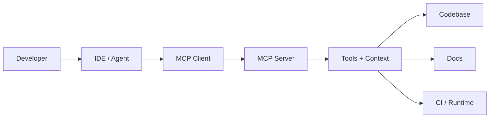

# layout intro

---

# Connecting Context

## The Future of MCP Transports

::meta::
Shaun Smith · 2026
::

---
layout: profile
handle: "@evalstate"
role: "Open source, agents, MCP"
---

# Shaun Smith

- Open Source MCP / Agents @ Hugging Face
- MCP Maintainer and Moderator
- Open Responses Maintainer
- Maintainer of `fast-agent` 

::links::
- github.com/evalstate
- huggingface.co/evalstate
- x.com/evalstate

::

---
layout: two-column
kicker: sample content slide 01
---

# MCP At Hugging Face

::left::

Use this slide to try out:

- Mermaid diagrams
- two-column content
- progressive edits
- callouts and code blocks

<Callout title="Edit me" tone="accent">
Replace this with your actual Tessl/MCP positioning, problem statement, or architecture story.
</Callout>

::right::



::

---
layout: default
kicker: sample content slide 02
---

# Cards, terminal snippets, and emphasis

<div class="card-grid">
  <MetricCard label="Context" value="Richer" note="Expose useful project knowledge" />
  <MetricCard label="Workflow" value="Faster" note="Keep the developer in the loop" />
  <MetricCard label="Protocol" value="MCP" note="Composable, inspectable integrations" />
</div>

<TerminalWindow title="example">

```bash
# Replace with your real demo commands
npm install
npm run dev
```

</TerminalWindow>

<Callout title="Try this next" tone="info">
Duplicate this slide, swap in a real demo screenshot or an interactive component, and keep the styling consistent.
</Callout>

---

# Streamable HTTP

## ssfsfd


---


# Protocol Features

<ProtocolStack size="md" />

---
layout: default
kicker: protocol features
---

# Most usage clusters on the server side

<ProtocolStack emphasis="usage" size="md" />

---
layout: default
kicker: protocol features
---

# Complexity lives in the long tail

<ProtocolStack emphasis="complexity" size="md" />


--- 

# What's new

## Stateless


---

# What's gone?


---
